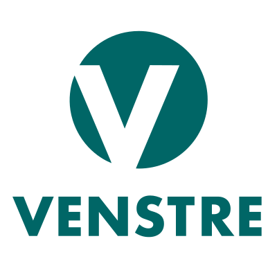

---
include-before:
- '`\newpage{}`{=latex}'
header-includes:
  - '\raggedright'
  - \usepackage{enumitem}
  - \setlist{leftmargin=5.5mm}
  - \usepackage[left]{lineno}
title: |
   | Gamle Oslo Venstre - Bydelsprogram 2023-2027
   | **Andre utkast**
   |
   |
   |
   |
   | 
   |
   | 

mainfont: "Sora-Regular.ttf"
mainfontoptions:
- BoldFont=Sora-SemiBold.ttf
geometry: margin=2cm
output: pdf_document
lang: nb-NO
toc: true
toc-depth: 2
---
\newpage
\linenumbers
# Innledning

Kjære velger,

Som Gamle Oslos liberale parti kjemper vi for å gi hvert enkelt menneske størst mulig frihet,
samtidig som vi tar vare på naturen og hverandre. Vår visjon er en grønnere, friere og rausere bydel,
noe som ligger til grunn for dette programmet.

Vi skal gjøre Gamle Oslo til foregangsbydel i klima- og miljøpolitikken, samtidig som vi tar vare på
den unike atmosfæren, og det brede, inklunderende og flerkulturelle miljøet vi har.

For å sikre en grønn og klimavennlig bydel, må det bli billigere å ta miljøvennlige valg i hverdagen.
Derfor vil Venstre ha billigere og bedre kollektivtransport, og gjøre byen mer tilgjengelig for syklister og gående.
Samtidig skal vi stanse nedbyggingen av natur, og ta vare på de fine grøntområdene vi har i bydelen, ruste opp parker,
og rense Oslofjorden og gjøre den tilgjengelig for alle.

Det skal være trygt og godt å vokse opp i Oslo.
Som liberale er vi opptatt av å gi barn og unge en utdanning og oppvekst som skaper like muligheter for alle.
Venstre satser på skolen fordi kunnskap er nøkkelen til å løse utfordringene vi står overfor og utjevne
sosiale forskjeller. Slik danner vi grunnlaget for at folk kan leve frie og gode liv.

Noe av det beste med Oslo er at vi har kultur for enhver smak, sjarmerende butikker og kulturbygg i verdensklasse, store smaksopplevelser
og små nabolagskafeer, brennende idrettsglede og steder å nyte roen. Derfor heier vi på ildsjeler som beriker byen,
på et fritt og mangfoldig kulturliv og på dem som vil skape en arbeidsplass for seg selv og noen til.
Vi vet at Oslo blir best når alle gode krefter bidrar og kommunen spiller på lagmed næringslivet, frivilligheten
og innbyggerne. 
 
Gamle Oslo skal være en raus og inkluderende bydel med plass til alle, uavhengig av bakgrunn, legning, livssyn,
kjønn, alder, funksjonsevne og livssituasjon. Derfor er Venstre opptatt av å stå opp for de som trenger det mest.
Vi skal bekjempe fattigdom og rasisme, og stille opp for sårbare grupper som i altfor lang tid har blitt møtt av
det offentlige med moralisme og stengte dører.

I en tid der liberale verdier er under stort press, både i Norge og i resten av verden, trengs et parti som står
opp for frihet og fellesskap, mot enkle populistiske løsninger.
Når du velger Venstre er du med på å støtte opp om de liberale verdiene.

Vi håper du vil bli med på laget.
 
Godt valg!

\newpage
# Klima og miljø
Verden står midt i en klima- og naturkrise. Venstre vil at Oslo skal være en
nasjonal og internasjonal pådriver for gjennomføring av klimakutt som
monner, og en by som tar vare på natur og dyreliv. Oslo må gå foran og vise
at grønn omstilling er mulig, uten at det går på bekostning av innbyggernes
livskvalitet eller frihet. 

## En klimavennlig bydel
Oslo må være en nullutslippsby innen 2030. Transport, avfall og bygg og an-
legg står for nesten alle utslipp i Oslo. Hovedinnsatsen må derfor legges her.
Bevaring, restaurering og reetablering av natur er avgjørende klimatiltak.
Det bidrar til reduserte utslipp og gjør oss bedre rustet til å håndtere klima-
endringene. Venstre ønsker derfor at bydel Gamle Oslo skal være en foregangsbydel,
med gode eksempler på hvordan det er mulig å redusere klimagassutslippene samtidig
som byen blir bedre å bo i.

**Gamle Oslo Venstre vil:**

* At Gamle Oslo skal være en nullutslippsbydel innen 2030.
* Stille strenge klima- og miljøkrav når utbyggingsområder planlegges.
* At byggeplassene i bydelen blir utslippsfrie.
* Stille krav om ren energiproduksjon og vegetasjon på tak og fasader i nye større bygg og lage incentiver for dette for eksisterende bygg, for å bidra til
klimatilpasning og økt biologisk mangfold.
* Øke produksjonen av fornybar energi i Oslo-området, blant annet ved å legge til rette for økt bruk av solceller på tak.
*  Bygge ut flere, og utvide eksisterende, miljøvennlige fjernvarmenett for oppvarming.
*  Gjøre det enklere å selge strøm fra solceller og annen lokal
produsert energi til nettet.

## Grønt hverdagsliv og sirkulærøkonomi
Å ta vare på miljøet handler om å ta ansvar, men det det handler også om å
gjøre Oslo til en bedre by å bo i. En grønn by, der det er enkelt og billig å leve
miljøvennlig, er en god by å bo i. Å gå, sykle og å reise kollektivt skal alltid
være det rimeligste og beste alternativet. Nordmenn ligger på verdens-
toppen i forbruk per innbygger. For å redusere belastningen som følge av
forbruk og avfall, må vi legge til rette for økt gjenbruk av materialer og deling
av ressursene. Venstre vil derfor gjøre det enklere og mer attraktivt å dele,
gjenbruke, ombruke og resirkulere.

**Gamle Oslo Venstre vil:**

* Sørge for at alle har en park eller et grøntområde i gangavstand fra sin bolig.
* Bevare eksisterende parsell-/kolonihager og skolehager
* Gjøre det enklere for innbyggere og næringsdrivende i Gamle Oslo å sortere og resirkulere avfall, blant annet ved å utvide åpningstidene ved gjenbruksstasjonene og sikre
et bedre tilbud for innsamling, gjenbruk og gjenvinning av tekstilavfall.
* At det skal være alternativer til GjenbruksID ved gjenbruksstasjonene
* Få slutt på overfylte søppeldunker ved å erstatte dem med smartere og mer innovative søppelkasser.
* Ha mulighet for kildesortering i alle søppelkasser i bydelen
* Stille krav om at næringslivet kildesorterer alt avfall.
* Stille krav til ombruk og gjenbruk av materialer i alle kommunale byggeprosjekter
* Stille krav om kildesortering fra næringseiendom
* Kreve avfallssug i nye større utbyggingsprosjekter i Gamle Oslo
* Forby vedfyring i peis og ikke rentbrennende ovner på dager med luftforurensing over grenseverdier
* Innføre en støtteordning for etablering av grønne tak og grønne vegger på eksisterende bygg
* Støtte borettslag til å implementere gode miljøtiltak som solcellepanel på tak og å dra nytte av overvann på tak
* Gjøre bildelingsordninger mer tilgjengelig med flere reserverte parkeringsplasser og flere ladeplasser.

## Mer natur i byen
Naturmangfoldet på jorda er under voldsomt press, og tap av natur bidrar til
økte klimagassutslipp. Den viktigste årsaken er at natur må vike for byg-
ninger og vei. Natur beskytter oss mot konsekvensene av klimaendringer
og ekstremvær og vi er helt avhengige av naturen for å få rent vann, ren luft
og stabil matproduksjon. Oslo Venstre vil derfor stanse nedbyggingen av
naturen og få mer natur i byen, ta vare på naturmangfold og reetablere og
restaurere natur som er blitt ødelagt.

**Gamle Oslo Venstre vil:**

* Etablere flere “parkgater” i indre og ytre by, der asfalt og betong omgjøres til mikroparker med trær og natur.
* Stille krav om at alle nye byutviklingsprosjekter bidrar til at Oslo får mer natur og grøntområder.
* Ha mer villplen og andre tiltak for å skape gode vilkår for dyreliv og innsekter.
* Styrke vernet av trær, plante flere trær og stille krav om at utbyggere planter flere trær når nye bygg oppføres, og at stedsegnede arter i større grad brukes.
* Oppgradere og bevare bydelens parker og grøntområder slik at de blir mer attraktive og for å styrke biologisk mangfold.
* Bevare trær og grøntområder, og sørge for at det er mer vill natur i bydelen.
* Legge til rette for mer urbant landbruk.

## Ren og levende Oslofjord
Venstre vil ha en ren Oslofjord og rene elver, fritt for plast og annen forurensing. Vi vil sørge for en bærekraftig forvaltning
av fisk og krepsdyr med sikte på å gjenoppbygge sviktende bestander, tilrettelegge for bading og skånsom bruk.

**Gamle Oslo Venstre vil:**

* Rense opp Oslofjorden, og innføre tiltak som sørger for renhold og ivaretagelse av områdene rundt Sørenga, Operastranda etc.
* Gjenåpne bekker og elver
* Sikre en ren Oslofjord, fri for plast, mikroplast og annen forurensning og fortsette opprydningen og rensingen av
havnebassenget
* Gjøre Oslofjorden til et marint verneområde
* Bevare allmennhetens tilgang til øyene i Oslofjorden, og sikre økt tilgang til strandsonene
* Ta i bruk alternativer til mikroplast på kunstgressbaner med sikte på å fase ut all bruk av gummigranulat
* Kartlegge alle utløp i bydelens elver og arbeide for å stenge skadelige utløp for godt
* Sikre at det er til enhver tid er rikt plante- og dyreliv i bydelens elver og utelukke alle forurensningskilder
* Gjøre fjorden og sjøen tilgjengelig for flere, ved å legge til rette for deleløsninger, klubb- og foreningsliv

\newpage
# Samferdsel
Sykkel, gange, nærings- og kollektivtransport skal prioriteres foran personbiler når det bygges ut ny transportkapasitet og
ved endring av det eksisterende veinettet.

## Gå- og sykkelbyen Oslo
Gamle Oslo Venstres mål er å skape en bydel der gående og syklende føler seg trygge i 
trafikken hele året. For mennesker med ulike funksjonsvariasjoner er Gamle Oslo 
fremdeles i stor grad en utilgjengelig by. For mange steder er byen er 
utformet på bilens premisser, med fysiske barrierer og plassbegrensninger 
for myke trafikanter. Vi vil styrke gang- og sykkelfeltene, og 
sørge for at indre by har et finmasket nett av bilfrie gater. Rundt skoler og 
barnehager vil vi opprette bilfrie soner, der barn fritt kan ferdes trygt og på 
egenhånd.

**Gamle Oslo Venstre vil:**

* Prioritere fotgjengere, sykkel og kollektivtransport foran privatbilisme.
* Stenge Finnmarksgata for annen trafikk enn HC og kollektivtrafikk. 
* Redusere biltrafikken i bydelen.
* Bedre forholdene for ikke-syklende myke trafikanter
* Innføre fartsreduserende tiltak i sentrumsnære områder, særlig i områder rundt barneskoler og lekeplasser for barn.
* Sikre alle barn trygge skoleveier, ved at alle skoler blir en del av hjertesonearbeidet. 
* Stenge Grønland for trafikk fra Vaterland Bru tilkrysset Tøyenbekken/Grønlandsleiret.
* Sørge for at Sentrumsnære områder i stor grad er steng for bilisme, men tilrettelagt for HC; varelevering og tjeneseutøvelse.
* Jobbe for at alle offentlige områder i Gamle Oslo blir universelt utformet.
* opprette flere bysykkelstasjoner og parkeringer i bydelens områder, deriblant ved Kampen-trappa, Valle-Hovin og Harald Hårdrådes plass

## Kollektivtransport
Venstre vil være en garantist for at kollektivtrafikken i Oslo skal være rimelig, ha hyppige avganger og nå ut til flest mulig.
Det handler om at du skal komme deg dit du skal på en god og miljøvennlig måte.

**Gamle Oslo Venstre vil:**

* At prisen på månedskortet reduseres til maks 600,- kroner, og maks 300,- for rabatterte billeter.
* Gi gratis kollektivtransport til alle under 18 år hele døgnet
* Sørge for at Ruter-appen automatisk omgjør enkeltbilletter til den beste tilgjengelige billetten etter hvor mange reiser brukeren har hatt
* Bedre fremkommelighet for trikk og buss, der det er nødvendig, å begrense gateparkering og gjennomkjøring, samt opprette kollektivgater
* Etablere bussterminaler på Bryn og Helsfyr, der de grønne bussene skal snu i stedet for å kjøre gjennom sentrum
* Sørge for en utvidelse av buss- og T-banetilbudet på nattestid i bydelen.
* Sikre universell utforming av kollektivtilbudet, både av transportmidlene og holdeplassene slik at alle, uansett funksjonsevne, skal kunne
reise miljøvennlig
* 20-bussen skal gå hele veien til Kværnerbyen/Svartdalsparken, via Dahlhaugs- og Enebakkveien slik at Svartdalsparken og området blir
lettere tilgjengelig for bydelen.
* At 81-bussen også skal kjøre innom Sørenga og at Sørenga kan bli teststed for selvkjørende busser

## Fremtidens T-banenett
T-banen er grunnstammen i kollektivtrafikken i Oslo. T-banenettet må utvides for å nå nye områder, og kapasiteten gjennom sentrum må økes for å
kunne ha flere avganger.

**Gamle Oslo Venstre vil:**

* Øke kapasiteten og frekvensen på T-banenettet gjennom blant annet bygging av ny sentrumstunnel.
* Utrede alternativer til Ruters anbefalte trasévalg, blant annet et alternativ som treffer Øvre Grünerløkka, St. Hanshaugen og Bislett og et
alternativ som treffer Øvre Grünerløkka, Ullevål Sykehus og Bislett. Traséen skal legges slik at Bislett stadion ikke står i fare for å måtte
rives i byggeperioden.
* Kjempe for ny sentrumstunnel for T-banen.

## En miljøvennlig bilpolitikk
Gamle Oslo har mye gjennomgangstrakk, dette gir både trafikale utfordring, støyforurensing og redusert luftkvalitet. Gamle
Oslo Venstre vil derfor redusere den totale biltrafikken. Der gateparkering fjernes skal det være for å tilrettelegge for gående,
syklister eller kollektivtrafikk, eller for å få økt byliv.

**Gamle Oslo Venstre vil:**

* Redusere behovet for bruk av bil i hverdagen, og tilrettelegge for at de som trenger bil har tilgang til ladeinfrastruktur og bildelingsordninger.
* Sørge for at det skal være mulig å komme seg frem til egen bolig ved behov, og at det skal være tilrettelagt for HC og kollektiv i sentrum.
* Innføre en moderat betaling på ladeplasser for å få økt sirkulasjon og økt tilgjengelighet.
* Øke støtten til etablering av ladeplasser i borettslag/sameier.
* Tilrettelegge tomter for etablering av hurtiglading.
* Gå mot store nye motorveiutbygginger inn mot Oslo dersom de øker biltrafikken, og kreve høye rushtidsavgifter og
prioritering av kollektiv på eventuelle utbygginger.
* Videreføre ordningen med beboerparkering og inkludere elbiler i ordningen til en redusert pris.
* Tilrettelegge for at flere av Oslos bilister benytter bildelingsordning heller enn å eie egen bil.
* Øremerke flere parkeringsplasser til bildeling.
* Rense utslipp fra biltunnelene i bydelen.
* Få fart på arbeidet med mer klimavennlig og koordinert varelevering i indre by, slik at vi reduserer bilkjøring og utnytter kapasitet i kjøretøy bedre.

\newpage
# Bydelsutvikling
Bydel Gamle Oslo har de siste årene åpnet seg mot fjorden og tusenvis av nyinnflyttede kaller nå Bjørvika sitt nye hjem.
I tillegg er Tøyenløftet i full gang og steder som Ensjø, Bryn og Helsfyr gjøres klart for flere nye mennesker. Hurtig
byutvikling krever også god plan- og tilrettelegging. For Venstre er det viktig at bydelens utvikling skjer på en inkluderende
og framtidsrettet måte, samtidig som vi tar vare på bydelens egenart og historie.

**Gamle Oslo Venstre vil:**

* Fortsette oppgraderingen av gater, parker og torg.
* At fortettingen skjer på en måte som ivaretar bydelens historie og grønne friarealer
* Vektlegge universell utforming ved oppgradering av gater, parker og plasser, samt sikre fremkommelighet også om vinteren
* Ta godt vare på framkommelighet, hindre støyplager og bidra til folks trivsel mens utbygging pågår
* Jobbe for at større anleggsarbeid ses i sammenheng og bidra til redusere støy og plager for naboer så mye som mulig.
* At hensynet til fotgjengere og syklister må ivaretas gjennom byggeperioder
* Redusere gjennomfartstrafikken i bydelen generelt, for eksempel ved å legge endestasjonen for enkelte av regionbussene
(grønnebusser) til andre deler av byen som Helsfyr
* Stille strenge krav til utbygging og utvikling av fasader og uteområder
* Sørge for bærekraftig utnyttingsgrad på Ensjø og andre områder som bygges ut for sikre gode bomiljø
* Kreve tidlig planlegging av nye skoler og barnehager ved større utbygginger for å sikre forutsigbarhet og nærhet for barn
og foreldre
* Sikre gode kollektivtilbud, gang- og sykkelveier allerede fra tidlig etablering i nye boområder
* Bevare den historiske murhusbebyggelsen i bydelen
* Verne om “parkagrensa”. Parker og grøntområder er under stort press for utbygging. Samtidig øker bruken i takt med
befolkningsveksten. Parkene må aktiviseres og utvikles for å møte det økte behovet. Parkene må vernes mot utbygging
og lysforholdene i parkene må ivaretas.
* At parker skal bygges tidlig i utbyggingsfaser og ikke vente til slutt i byggeperiodene

## Delbydelsutvikling
Gamle Oslo Venstre vil sikre utvikling av de ulike områdene i bydelen ved å sikre bærekraftige premisser, skape gode lokalmiljøer
samtidig som vi ivaretar særpreget til bydelens historiske områder. Det er også viktig at befolkningen i områdene blir hørt i
forhold til sine behov i deres områder, selv om dette skiller seg ut fra resten av bydelen.

**I Nedre Tøyen og Kampen delbydeler vil Gamle Oslo Venstre:**

* Følge opp Nasjonalteaterets ombygging av Munch-museet så det blir en inkluderende kulturmøteplass for hele byen påTøyen
* Videreutvikle Tøyen som nærmiljø utover tiltakene som ligger i Tøyenløftet
* Legge grøntlokk over Finnmarksgata
* Sikre grøntområder i utbyggingen rundt nye Jordal
* At det snarest må settes istand en permanent løsning for flerbrukshall på Tøyen. Den midlertidige hallen må ikke bli
permanent.
* Oppgradere Tøyen T-banestasjon
* Stenge Kolstadgata
* Videreutvikle K1 som aktivitetshus i bydelen
* Endre boligsammensetningen rundt Tøyen og redusere andelen kommunale leiligheter i området
* Ha flere boliger tilrettelagt for familier i området

**I Kværnerbyen delbydel vil Gamle Oslo Venstre:**

* Jobbe for å flytte lokomotivverkstedet og togvasken i Kværnerdalen ut av byen
* Sikre at historien til Gamlebyen fremheves for både besøkende og beboere
* At Middelalderparken blir sammenhengende med Ruinparken
* At det etableres sammengenhengende park fra Dyvekes bru til Middelalderparken
* Gjenskape Oslo torg til slik det framsto i middelalderen og fram til 1800-tallet, samt redusere trafikken i området.
* Sørge for at Botsfengselet blir utviklet til en møteplass for alle, med boliger, kulturtilbud og ulike næringer med inspirasjon
fra Tøyen torg.
* At Klosterenga park oppgraderes parallelt med endringen av botsfengselet

**I Bispevika delbydel (Bjørvika og Sørenga) vil Gamle Oslo Venstre:**

* Etablere en bussrute som gir besøkende og beboere tilgang til offentlig transport, på Sørenga i første omgang.
* Etablere et grøntlokk med sykkeltrasé over jernbanelinjene ved Oslo S for å skape en sammenhengende park mot
Middelalderparken og en bedre kobling mot Grønland
* Tilrettelegge for foreninger med fokus på sjøliv, for eksempel kajakklubb, roklubb, seiling og vindsurfing
* Få på plass en grunnskole på Sørenga
* At fritidsanlegg som har blitt neglisjert raskest mulig blir istandsatt og vedlikeholdt
* At 81-bussen også skal kjøre innom Sørenga og at Sørenga kan bli teststed for selvkjørende busser
* At renhold, søppeltømming og toalettfasiliteter reflekterer behovet som skapes av det store antallet badegjester
* Sørge for en permanent broovergang fra Sukkerbiten eller Munchmuseet til Sørenga
* At det etableres offentlige toalettfasiliteter ved den nye badeplassen mellom Operaen og Sukkerbiten
* At det vurderes etablering av et oppvarmet badeanlegg i området, slik de har i Helsinki
* Jobbe for å få på plass en permanent bru mellom Sørenga og Sukkerbiten.

**På Grønland og Enerhaugen delbydeler vil Gamle Oslo Venstre:**

* Fjerne Nylandsbrua for å åpne opp området, og forbedre forholdene ved Olafiagangen og Vaterland ved å tilrettelegge
for nytt og innovativt næringsliv, f.eks. opprette en tradisjonell mathall eller etablere konsertscene, og gi mer plass til
ungdomsklubben.
* Åpne Grønlandsområdet mer mot sjøen og binde det sammen med Bjørvika ved å transformere Galleri Oslo og gjøre det
til en mindre dominerende barriere ved å sikre gjennomgang fra Grønland til Schweigaardsgate
* Oppgradere Grønland som gågate fra Grønlands torg til Brugata
* Etablere et grøntlokk med sykkeltrasé over jernbanelinjene ved Oslo S for å skape en sammenhengende park mot
Middelalderparken og en bedre kobling mot Bjørvika
* Jobbe for økt politinærvær og nærvær av Oslovaktene i området for å redusere den ulovlige virksomheten i gatene
* Jobbe for å bedre fremkommeligheten mellom Grønland og Bjørvika og binde sammen delbydelene i større grad
* Jobbe for å få kultur inn i Botsparken

**På Etterstad, Ensjø og Vålerenga delbydeler vil Gamle Oslo Venstre:**

* Redusere hastigheten på Grenseveien og sikre bedre fortau og sykkelveier.
* Gjøre Gladengveien, Ensjøveien og Strømsveien tryggere for myke trafikanter ved å ytterligere redusere hastighet og gjennomkjøring.
* Bygge et nytt kryss i skjæringen Gladengveien og Ensjøveien.
* Sørge for at det blir regulert tilstrekkelig med barnehager, skoler og grøntarealer i nye boligområder som i Hovinbyen.
* Bedre trafikkforbindelsen mellom Bryn og Carl Berners plass med trikk i Østensjøveien/Grenseveien.
* Tilrettelegge for flere elbilparkeringsplasser på Valle, Lilleberg og Malerhaugen.
* Jobbe for at gjenstående tomter på Ensjø blir utviklet, ved å ivareta og sikre et grønt og åpent lokalmiljø med rom for møteplasser.
* Knytte Hovinbyen sammen med Østmarka ved hjelp av et grøntdrag.
* Flytte Tøyen togstasjon til Ensjø.
* Sikre at det strøs og måkes på trapper på ulike bydeler for å sikre fremkommelighet på vinteren.
* Gjøre Svartdalsparken mer tilgjengelig for bydelen, oppgradere anlegg og vedlikeholde stier og trapper i byens eldste urskog.
* Videreutvikle nærmiljøhuset på Petersborgtorget

## Parker og uteområder

Venstre vil etablere flere parker og ta vare på de grøntområdene som finnes. Vi vil sikre godt vedlikehold og gjøre byens parker
mer attraktive gjennom bedre vedlikehold og etablering av flere fasiliteter som lekeapparater, treningsapparater, parkmøbler
og toaletter.

**Gamle Oslo Venstre vil:**

* Bevare store trær og plante nye trær i bydelen
* Gjennomgå midlertidige bygg i friområder og lage en plan for når og hvordan de skal fjernes
* Holde det rent, ryddig og søppelfritt i hele bydelen
* Plante bie- og humlevennlige planter i grøntområder
* Redusere bruken av veisalt, særlig i områder det skader trær og planter, og etablere flere fortau med varme i bakken i de
mest brukte gatene i bydelen
* Senke grensenivået for tiltak mot tungmetaller i jord for nye lekeplasser, barnehager og boligområder
* Legge til rette for urbant landbruk, inkludert legge til rette for urban birøkting

## Kommunale boliger
Gamle Oslo har mange innbyggere som bor i kommunale boliger. Dette har innvirkning på hele bydelen. Det er viktig å sørge
for gode bomiljø i de kommunale boligene og at boligene har god standard. Barnefamilier skal kunne kjenne seg trygge
hjemme og i nærområdet sitt.

**Gamle Oslo Venstre vil:**

* Innføre flere bomiljøarbeidere for å bedre bomiljøet i og rundt kommunale boliger
* Forbedre sammensetningen av boliger
* Øke antall større boenheter i den kommunale boligmassen
* Spre de kommunale boligene i bydelen
* Jobbe for at bystyret reduserer antall kommunale boliger i bydelen
* Unngå samlokalisering av barnefamilier og beboere med rus- og psykiatriutfordringer
* Sørge for botrenings- og sikkerhetskurs samt sørge for at beboerne er godt informert om rettigheter og plikter.

## Medvirkning
Oslos innbyggere burde i større grad kunne være med å planlegge sin egen fremtid ved å delta i beslutningsprosesser tidlig.
Forvaltningen bør gå aktivt ut for å skape engasjement rundt planer som har direkte betydning for folks hverdag, inkludert
plan- og byggesaksprosesser. Gjennomføringen blir bedre og raskere når beslutninger er forankret hos innbyggerne.

**Gamle Oslo Venstre vil:**

* Gi bydelene mer myndighet over lokale plansaker, veier, trafikk og parkering
* At alle store utviklingsprosjekter skal ha en faglig utredning og evaluering
* Fortsatt la bydelene ha ansvaret for drift av barnehagene, og gi bydeler som ønsker det forvaltningsansvar for
barnehagebygg
* At bydelen skal rådføres før kommunen selger eller kjøper eiendom i bydelen
* At den enkeltes syn på egen sak vektlegges i større grad når bydelen behandler saker som gjelder den enkelte
* At brukermedvirkning skal være ivaretatt når bydelen utvikler sine tjenester

\newpage
# Utdanning og Oppvekst
Skole er et kommunalt ansvar, men bydelen er ansvarlig for oppfølging av barn og unge i bydelen. Mye aktivitet skjer i
tilknytning til skolene, slik som aktivitetsskole, helsesykepleier, Friluftssenteret i Gamle Oslo (FRIGO) og aktivitetsklubber.
Gamle Oslo Venstre vil fortsette å satse på barn og unge, og tilby gode rammer for å gjennomføre aktiviteter i tilknytning til skole og aktivitetsklubber.

## Osloskolen
Gamle Oslo Venstre vil ha en friere skole hvor hva du lærer er viktigere enn hvordan, og der skolen sikrer like muligheter for
alle barn. Det krever at undervisningen tilpasses den enkelt elevs utgangspunkt, interesser og ferdigheter, og ikke
motsatt. Selv om Osloskolen i stor grad bidrar til å utjevne sosiale forskjeller, har vi fortsatt en vei å gå. En god skole koster
penger, og det er Venstre villig til å prioritere.

**Gamle Oslo Venstre vil:**

* At ressursene skal tilpasses behovene på den enkelte skole; det vil si at alle skoler skal være rustet til å gi et godt tilbud
til sine elever, samtidig som at enkelte skoler skal få nok ressurser til å møte elever som trenger tettere oppfølging.
* At alle skoleveier skal være trygge og at det tilrettelegges for sykling til skolen.
* Vil legge til rette for at bydel, lokalt næringsliv og idrettslag inngår forpliktende samarbeid med skolene i nærområdet
for å hindre fravær på barne- og ungdomstrinnet og frafall fra videregående opplæring.
* Ha nulltoleranse mot mobbing i skolen.
* Sette krav om kompetanse innen karriereveiledning og flerkulturell kompetanse må også veie tungt for rådgivere i skolen.
* Styrke Friluftssenteret i Gamle Oslo (FRIGO), og øke dets samarbeid med bydelens skoler.
* Sikre at skolene i bydelen skal være åpne for frivillige aktører og andre som ønsker å lage aktivitetstilbud til barn og unge.
* Styrke norskundervisningen i Osloskolen, blant annet ved å øke kvaliteten på den særskilte norskopplæringen, og ha krav
til fremgang i målene som settes for slik opplæring.
* At elever som går i mottaksklasser skal ha en skoledag der de i størst mulig grad integreres med den øvrige elevmassen,
og i større grad deltar i fellesfag.
* Sørge for at elever med behov for det, får spesialundervisning av spesialpedagoger, og at tiltak settes inn så tidlig som
mulig også som en integrert del av klassemiljøet.
* Opprette flere plasser i Sommerskolen, og gjøre tilbudet kjent i bydelen.
* Ikke tillate narkorazziaer eller kameraovervåkning mens barna er på skolen.

## Læreren
Gode lærere er det aller viktigste for elevenes læring. Venstres svar på utfordringene i Osloskolen er å sikre høy kompetanse
og bedre vilkår for lærerne og skolelederne, styrke grunnskolen som allmenndannende del av skoleløpet.
kunnskapsrike lærere, som er omgitt av gode og stabile fagmiljø, er avgjørende for å sikre økt læring og mindre uro i Osloskolen.

**Gamle Oslo Venstre vil:**

* Rekruttere de beste lærerne til Gamle Oslo ved å tilby høyere lønn og bedre betingelser.
* Tilrettelegge for økt digital kompetanse blant lærere i bydelens skoler, blant annet for mer visuell opplæring for de minste.
* Jobbe aktivt for å rekruttere flere menn og flere med minoritetsbakgrunn inn i bydelens skoler.
* Gi lærerne mer tid til hjem/skole-samarbeid, og til å bli bedre kjent med lokalmiljøet og bakgrunnen til sine elever og
foreldre.
* Sikre lærerne et godt støtteapparat som følger opp elevenes utenomfaglige behov slik at lærerne kan ha fokus på faglig oppfølging.

## Barnehage
Gamle Oslo Venstre er opptatt av et mangfold i barnehagetilbudet, slik at du kan velge et tilbud både når det gjelder
innhold og åpningstid, som passer for deg og din hverdag og der ditt barn trives. Tilstrekkelig med kompetente ansatte, gode
uteområder og variasjon i aktivitetstilbudet til barna er viktig for sikre høy kvalitet på barnehagene våre uansett hvem som
leverer tjenestene.

Kompetanse hos ledelse, lærere og ansatte, gode inne- og utemiljø og nok 
voksne er helt avgjørende for barna. Kvaliteten på barnehagene i Oslo 
varierer, og enkelte barnehager har for lav voksentetthet eller for lav 
kompetanse blant de ansatte. Gamle Oslo Venstre vil alltid sette kvalitet først.

**Gamle Oslo Venstre vil:**

* At alle skal ha mulighet til å få plass i en barnehage i sitt nærmiljø.
* Jobbe for oppheve forbudet mot private aktører i Oslobarnehagen
* Jobbe for å etablere en kveldsåpen barnehage i bydelen, kombinert med makstid per døgn og uke
* Jobbe for å ha en riktig dekning av barnehageplasser ut i fra de ulike behovene i delbydelene, gjerne i forbindelse med
knutepunkter
* Etablere sommerskole for skolestartere som ikke har gått i barnehage eller har dårlige norskferdigheter
* Tilby åpen barnehage til de barna som ikke går i vanlig barnehage
* Tilby systematisk lederutvikling for styrer/daglig leder i barnehagene i bydelen
* Sette i verk tiltak for å sikre et godt barnehage/hjem-samarbeid med fokus på tidlig innsats og jobbe for at flere velger
å la barna sine gå i barnehage
* Sikre kvalitet i alle barnehager, kommunale som private, ved at hver enkelt barnehage har nok kompetente ansatte
gjennom pedagog-og bemanningsnorm, tilstedeværende leder, vikar ved behov og godt vedlikehold av bygningsmasse og
utearealer
* Legge til rette for et mangfoldig tilbud av type barnehager, slik at foreldre kan velge barnehageplass også ut fra
barnehagens profil
* Sette av minst 1 million i året til oppgradering av lekeapparater og uteområder i barnehagene i bydelen.
* Innføre opplæring i grensesetting og seksualitet fra og med barnehagen.

## Barneskole
Å få en god start på skolegangen er avgjørende for å lykkes senere i utdanningsløpet. Vi vet at det er store forskjeller
i modenhet innenfor et årstrinn, og at mange barn starter på skolen uten å kunne godt nok norsk til å følge ordinær
undervisning. Osloskolen må ta tak i disse utfordringene som er svært relevante spesielt i bydelen vår.

**Gamle Oslo Venstre vil:**

* Gjøre det enklere å utsette eller fremskynde skolestart.
* Legge til rette for at elever skal få hospitere i andre klassetrinn i fag der de ligger på et annet nivå enn eget klassetrin
* At kartleggingsprøver først og fremst skal benyttes som pedagogiske verktøy for å gi hvert barn faglige utfordringer på
riktig nivå og identifisere eventuelle behov for tilrettelagt opplæring
* Utvide svømmeundervisningen slik at alle barn i bydelen lærer å svømme i løpet av barneskolen
* Sørge for raskere ferdigstillelse av barne- og ungdomsskole på Sørenga, med bredt opptak fra bydelen
* Styrke tilbudet til tilpasset opplæring for elever med høyere læringspotensial.
* Innføre andre fremmedspråk fra femte klasse og gi flere valgmuligheter enn i dag. 

## Aktivitetsskolen
Aktivitetsskolen er et viktig tilbud for mange elever, og det bør derfor være tilgjengelig for flere. Spesielt viktig er det å øke
deltakelsen i AKS blant de elevene som trenger mer oppfølging og trening i ferdigheter.

**Gamle Oslo Venstre vil:**

* La alle elever få muligheten til å gå gratis på Aktivitetsskolen
* Stille krav om at AKS-ledere har en relevant kompetanse
* At AKS samarbeider med frivillige organisasjoner, aktører innen kulturlivet og idrettslag for å gi barn en variert og
innholdsrik hverdag

## Ungdomsskolen
Det er bekymringsverdig at motivasjonen og læringen til Oslos elever faller
når de starter på ungdomsskolen. Det trengs tiltak for å sikre at flere
fullfører grunnskolen med et godt utgangspunkt for videre utdanning.
Ungdomsskolen skal motivere og engasjere elever til å fordype seg i fagene
og oppdage hvilke interesser og ønsker de har for sitt liv.

**Gamle Oslo Venstre vil:**

* Vurdere prøveprosjekt med profilskoler i grunnskolen, med skoler som spisser undervisningen inn mot utvalgte tema som realfag, språk, kunst eller kultur.
* Søke om å få øke timetallet i, og tilbudet av valgfag, for å gjøre ungdomsskolen mer motiverende for elevene.
* Utvide ordningen med et ekstra år med 11. klasse eller intensivkurs for de som ikke har bestått fag.
* Styrke den tilpassede opplæringen ved å legge til rette for at elever kan få tilrettelagt undervisning i fag der de ligger på et annet nivå enn eget klassetrinn.
* Sikre faglig tilpasning ved å gjøre det enklere å hoppe over klassetrinn eller gå om igjen, når det vurderes best i tråd med elevens faglige nivå og utvikling,
i samråd med foresatte og eleven selv.
* Stimulere til samfunnsengasjement ved at også ungdomsskoleelever skal kunne ta ut politisk fravær.
* Åpne for muligheten for å ha valgfag i flere fremmedspråk enn det som tilbys, blant annet de mest utbredte morsmålene
i bydelen
* Sørge for at retten til plass på nærskolen er reell
* Åpne for et ekstra skoleår mellom ungdomsskolen og videregående for å kvalifisere flere til vgs ved Jordal ungdomsskole
* Lage tilbud med intensivkurs for elever som ønsker å styrke kunnskapene sine i enkeltfag før videregående opplæring
* Sørge for raskere ferdigstillelse av barne- og ungdomsskole på Sørenga, med bredt opptak fra bydelen

## Videregående opplæring
Vi har flere videregående skoler plassert i bydelen vår som er viktig for tilbudet for ungdom fra hele byen.

**Gamle Oslo Venstre vil:**

* Beholde fritt skolevalg slik at elever fortsatt kan velge skole basert på interesser og ikke låses basert på postnummeret
til foreldrene.
* Styrke Osloskolens arbeid med frafall og samarbeide med bydelen om andre tjenester og oppfølging til elever som står i
fare for å falle ut av skolen.
* Gjennom oppsøkende arbeid styrke bydelens arbeid mot frafall fra videregående opplæring.
* Sørge for kommunal finansiering av skolehelsetjeneste på videregående nivå, slik at tilbudet sikres å være iht. skolens
behov, og ikke budsjettmodeller, gjennom bydelen som ikke gjenspeiler elevmassens størrelse.
* Opprette gjennomføringsteam i bydelen som skal bidra til at elever som står i fare for å falle ut av skolen skal få bedre
hjelp til å gjennomføre ungdomsskole og videregående opplæring
* Støtte skoler som ønsker å prøve ut nye valgfag og fremmedspråk,
og være positiv til friskoler med pedagogisk alternativ.
* Øke tilbudet av studieforberedende tilbud som gir
studiekompetanse uten full fordypning, som idrettsfag, medier og
kommunikasjon.

**For yrkesfag vil Gamle Oslo Venstre:**

* stille krav om lærlingplasser ved kommunale anbud spesielt i vår bydel, ha flere Varde-prosjekter og øke inntaket av
lærlinger i kommunens virksomheteR
* Styrke kvaliteten på lærlingers opplæring ved å etablere
oppfølgingsansvar i overgangen mellom skole og bedrift.

## Skolehelsetjenesten
For å skape et godt psykososialt læringsmiljø for elevene er det nødvendig med en god skolehelsetjeneste, som kan hjelpe
elevene med helseplager og andre utfordringer som elevene møter i skolehverdagen. Skolehelsetjenesten er under bydelens
ansvarsområder og det er viktig å sikre et godt tilbud for skolene.

**Gamle Oslo Venstre vil:**

* Gjøre skolehelsetjenesten mer tilgjengelig for Oslos lærlinger gjennom flere ansatte og utvikling av plattformer for digital skolehelsetjeneste.

## Læringsmiljø

**Gamle Oslo Venstre vil:**

* Jobbe for å ta igjen vedlikeholdsetterslepet i Osloskolen.
* Gjennomføre et grønt skolegårdsløft i byens skolegårder og
uteområdene i barnehagene.
* Styrke skolebibliotektjenesten ved å ha gode innkjøpsbudsjetter, lengre åpningstider og kvalifisert personale på alle skolebibliotek og samarbeid
* med lokale bibliotek.
* Sikre at religiøse og kulturelle normer ikke hindrer barns deltakelse i undervisning, samtidig som det religiøse og kulturelle 
mangfoldet blant elevene blir respektert.

## Studenter
Oslo skal være landets beste studentby. Studenter tilfører byen liv og kultur
og er en viktig del av Oslo befolkning. I dag er det er vanskelig for studenter
å finne seg rimelige og egnede boliger, og for mange tilbud oppleves dyre
og utilgjengelige for studenter med dårlig råd. Vi må tilrettelegge for flere
studentboliger og et bedre og rimeligere kulturtilbud for studenter.

**Gamle Oslo Venstre vil:**

* Sikre at alle kulturtilbud som mottar kommunal støtte skal ha studentrabatt.
* Bedre studentidrettens tilgang på anlegg.
* Bidra til en god studentkultur i bydelen, gjennom tett samarbeid medstudentsamskipnaden.
* Tilby flere studierelevante praksisplasser i bydelens tjenesteområder.
* Bidra til gode vilkår for studentkultur og studenttilbud
* Bedre studentidrettens tilgang på anlegg i bydelen uten at det går ut over barne- og ungdomsidretten
* Jobbe for at veksthus og andre utdanningsrelaterte institusjoner etablerer seg i bydelen der det er hensiktsmessig.
* Jobbe for at Gamle Oslo skal bli en attraktiv bydel å bosette seg i for studenter.

## Oppvekst og nærmiljø
En viktig del av oppveksten til alle barn er nærmiljøene rundt hjem og skole, og vi må derfor sørge for lekemuligheter i nærmiljøet, gode grøntområder 
og tryggtrafikk. Gamle Oslo Venstre vil derfor videreføre områdeprogrammene i de bydelene
det gjelder, og samtidig styrke arbeidet med gode nærområder i hele bydelen.

**Gamle Oslo Venstre vil:**

* Sikre gode utearealer for alle barn, og etablere flere lekeplasser for barn i bydelen
* Oppgradere bydelens grøntområder og gjøre dem mer tilgjengelig og attraktiv for barn og ungdom.
* Arbeide for at alle barn i bydelen har trygge skoleveier, blant annet gjennom å stenge eksisterende bilveier for trafikk,
begrense grønne busser i sentrum eller redusere tillatt hastighet, dette gjelder f.eks. skolevei til gamlebyen skole fra Sørenga.
* Undersøke mulighetene for å stenge Kolstadgata ved Tøyen skole for å utvide skolegården og utvide skolegården på Gamlebyen skole
* Støtte sosiale og kulturelle entreprenører, frivillige organisasjoner og idrettslag som ønsker å skape lavterskel fritidstilbud og møteplasser for barn og unge
* Jobbe for at bydelens barn og unge under 18 år får dekket kontingenter til fritidsklubb/idrettslag/korps/kor eller lignende slik at alle har et sted å være og
et sted å mestre etter skoletid.
* Gjøre det lettere å starte opp aktivitetstilbud til ungdom i bydelen og åpne for større innslag av aktivitet for og avungdom.
* Sikre god drift av ungdomsklubber i bydelen, ved at de har variert tilbud og er attraktive, tilgjengelige og gode møteplasser spesielt for ungdom mellom 15-18 år.
* Ha lokalkjent politi- og miljøteam i bydelen for å etablere kontakt med utsatte ungdomsgrupper og jobbe mer forebyggende
* Styrke oppsøkende tjenester/utekontakt i bydelen
* Bidra til at flere menn jobber med barne- og ungdomstiltak som gode rollemodeller
* Ha en ordning for aktivitetsbuss for barn og unge, der idrett- og kulturlag kan busses til fritidsaktivitet
* Jobbe for et langsiktig samarbeid mellom familier som trenger ekstra oppfølging, for å sikre at alle barn i bydelen gjennomfører skoleløpet og får en trygg oppvekst
* Jobbe for at Grønland politistasjon gjennopptar arbeidet med "Ut i det fri med Oslo Politi"
* Starte prosjekter der tjenester som barnevern, psykolog og NAV flyttes inn i skolen og ha aktivitet på skolens område også utenom skoletid 
(etter modell fra “Community schools” i Storbritannia), og gjennomføre slike tiltak f.eks. på Tøyen skole også på andre skoler som f.eks. Vahl skole.
* Erstatte bruk av gummidekke som underlag på nye lekeplasser og uteområder med mer natur- og miljøvennlige alternativer.
* Gi unge mulighet til å få arbeidstrening og arbeidserfaring, uten at dette går utover inntektsgrenser for stødnader.

## Barnevernet
Gamle Oslo Venstre ønsker et barnevern som har tid og ressurser til å sette barnet i sentrum. Et godt barnevern er et barnevern
som har tillit i befolkningen, og som har tid og mulighet til å gjøre gode undersøkelser og tiltak når det er nødvendig.
Barnevernet skal jobbe kunnskapsbasert, og ikke påstandsbasert, for å finne de metodene som fungerer best for barna selv.
For å kunne gi god hjelp trenger barnevernet faglig sterke medarbeidere med gode kommunikasjonsferdigheter.

**Gamle Oslo Venstre vil:**

* Øke tilskuddet til barnevernet.
* Ha mer fokus på forebyggende arbeid i barnevernet, med aktivt samarbeid med familiene som trenger deres hjelp.
* Styrke barns medvirkning i avgjørelser som angår dem og sikre at barnets beste blir ivaretatt.
* Gjøre barnevernet mer tilgjengelig slik at barn og foreldre i bydelen får bedre kjennskap til sine rettigheter og hva
barnevernet kan hjelpe dem med.
* Sikre nødvendig kompetanseheving i barnevernet og en enda bedre flerkulturell forståelse.
* Sikre tilstrekkelig ressurser til godt ettervern.
* Styrke fosterhjemstjenesten for å gi bedre støtte til fosterhjem og bedre rekrutteringen av fosterhjem, spesielt med
flerkulturell bakgrunn.
* Styrke tolketjenesten for å styrke rettssikkherheten til familier som ikke snakker norsk.

\newpage
# Kultur, idrett og friluftsliv
Oslo skal fortsatt ha et fritt, sterkt og selvstendig kultur- og idrettsliv. Vi skal støtte mangfoldet og bredden, samtidig som vi dyrker frem talentene. 
Kommunen skal være en støttespiller for kulturlivet og idretten og sørge for at alle, uavhengig av utgangspunkt, skal få oppleve kultur og idrettsglede.

## En kulturby i verdensklasse
Det er et høyt aktivitetsnivå på kulturfeltet i bydelen. Venstre vil at alle skal ha mulighet til å oppleve kunst og kultur,
uavhengig av alder, inntekt og funksjonshemninger.
Den beste måten for bydelen å støtte opp om kulturlivet på, er ved å la kulturen være fri og bidra konstruktivt med arealer, lokaler og virkemidler til
initiativer fra kulturlivet selv.

**Gamle Oslo Venstre vil:**

* Starte innføringen av et fritidskort på 5000 kroner årlig for alle mellom 10 og 18 år som kan brukes på kultur-, fritids- og idrettstilbud.
* Stille kommunale bygg og plasser til rådighet for kulturarrangementer og at kommunale bygg som står midlertidig tomme, skal tilbys kulturaktører for leie.
* At kommunens virksomheter skal ikke konkurrere med kulturlivet, men heller støtte initiativ som kommer fra kulturlivet.
* Styrke bibliotektilbudet i hele bydelen med selvbetjening utenfor åpningstid i alle filialer, samt ha forsøk med selvbetjente skolebibliotek på kveldstid.
* Styrke tilskuddsordningene til kultursektoren og forenkle søknadsprosessene til bydelens midler.
* Bygge ut kulturell infrastruktur i hele byen, blant annet ved å stille krav om lokaler til kultur i større områdeutbygginger og tilrettelegge for lokale 
scener i bydelene med servering og aktiviteter i form av musikk, humor, revy, teater, litteratur, e-sport og annen kulturaktivitet.
* Jobbe for god etterbruk av det gamle Munchmuseet til kulturformål eller formål som gagner nærmiljøet.
* Videreutvikle Middelalderbyen.
* Sikre støtte til konsertarrangører som arrangerer konserter uten alkoholservering eller har alkoholfrie soner på sine arrangementer, for å sikre bedre tilbud
for ungdom.
* Gjøre kulturtilbudene i Oslo mer attraktive for ungdom og gi ungdom opp til 18 år et godt og variert kulturtilbud i hele byen, i form av blant annet
øvingslokaler for musikk og e-sport-tilbud.

## Et levende uteliv
Utelivet er en viktig del av enhver storby, og noe av det som gjør Oslo til en spennende og god by å bo i. Serveringsnæringen skal tilby noe for enhver smak,
samtidig som vi skal sørge for at bedriftene drives på en forsvarlig og trygg måte.
Gamle Oslo Venstre mener at skjenkebevilling skal være lett å få, og lett å miste ved misbruk eller mislighold. Venstre ønsker seriøse og
langsiktige aktører i utelivsbransjen i bydelen. Omsetning av alkohol skal foregå i ordnede former.

**Gamle Oslo Venstre vil:**

* Legge til rette for etablering av kafeer, utesteder og restauranter i nærområdene, inkludert alkoholfrie tilbud.
* At hele bydelen skal regnes som et skjenkeområde med skjenking inne til kl 03.00 etter dagens regler.
* Utvide skjenketidene og åpne for mer differensierte og lokalt bestemte åpningstider.
* Bydelen selv skal ha retten til å bestemme over skjenkebevilgningen i hele bydelen.
* At støyklager og andre klager i forbindelse med skjenkesteder raskt skal kunne føre til innskrenking av skjenketiden eller inndragelse av løyvet,
avhengig av klagens alvorlighetsgrad og problemets omfang.
* Redusere rusbruk i Oslos uteliv, blant annet ved å legge til rette for at folk kan kvitte seg med illegale rusmidler ved bruk av såkalte amnesty boxes.
* Åpne for at det kan gis skjenkebevilling til eksempelvis frisører, bokhandlere og klesbutikker gitt at de retter seg mot et voksent publikum.
* Tillate alkoholservering på enkelte idrettsarrangement rettet mot voksne.
* 

## Frivillighetshovedstaden
Frivilligheten lager rom for inkluderende møteplasser, fellesskap og læringsarenaer. Den gir mennesker i alle aldre mulighet til å ta ansvar og engasjere
seg i samfunnet og har stor egenverdi. For Venstre er det helt grunnleggende at frivilligheten får utvikle seg på egne premisser. Det offentlige skal ikke
styre hvilken retning frivilligheten skal ta, hvilke aktiviteter som skal utføres eller initiativ som skal tas. Kommunens oppgave er å tilrettelegge for frivillig
aktivitet, blant annet gjennom å skape møteplasser og å forenkle
søknadsprosessene for frivillige organisasjoner.

**Gamle Oslo Venstre vil:**

* Gjøre det enklere å drive frivillige organisasjoner
* Styrke koordineringen av frivillighetsarbeidet i bydelen
* Tilby flere av bydelens lokaler til bruk av frivilligheten
* Satse spesielt på frivillige organisasjoner for ungdom
* Styrke frivillighet som møteplass for folk som står utenfor arbeidslivet
* Åpne bydelens skolebygg for alternativ bruk etter ordinær skoletid, slik som møtelokaler for lag og foreninger, privat
undervisning, idrett eller kulturaktiviteter, etter modell fra meråpne bibliotek
* Støtte frivillige organisasjoner som skaper møter mellom minoritets- og majoritetsbefolkningen
* Samarbeide med frivillige organisasjoner for å få flere barn og unge til å delta på fritidsaktiviteter, bedre folkehelse og oppvekstvilkår og redusere utenforskap.
* Inkludere frivillige organisasjoners behov bedre i utformingen av bydelen.

## Friluftsliv i byen
Friluftsliv gir rike naturopplevelser, er helsefremmende og er den
aktiviteten flest mennesker deltar i. Å legge til rette for friluftsaktiviteter der
folk bor, koster lite, men det krever aktiv tilrettelegging og
tilgjengeliggjøring av arealer. Venstres mål er at alle skal ha tilgang til
nærnatur og turterreng i nærheten av der de bor.

**Gamle Oslo Venstre vil:**

* Sørge for at alle har mulighet til å delta i friluftsaktivitet gjennom samarbeid og støtte til friluftsorganisasjoner.
* Utvikle bydelen slik at alle boliger, skoler og barnehager ligger i
gangavstand til grøntområder og turstier.
* Sikre at flere turstier får belysning som ikke skaper lysforurensing og etablere og vedlikeholde universelt utformede turstier og ruter.
* Etablere sammenhengende kyst- og elvestier og ivareta allemannsretten i Oslo, blant annet ved å stramme inn bygging i strandsonen og fjerne sperringer
* At kommunen skal samarbeide med lokale turlag og historielag om å ta vare på, kartlegge og tilgjengeliggjøre kulturminner i bydelen.
* Tilrettelegge bedre for bynært friluftsliv.
* Etablere flere hundeparker
* Ha flere offentlige drikkefontener og toaletter i bydelen.

## Idrettsglede for alle
Idrett skaper trivsel, sosiale nettverk og god folkehelse. Gamle Oslo Venstre vil legge til rette for at flere av bydelens barn og
unge inkluderes i idrettsliv og aktiviteter. Gamle oslo og indre by har for få idrettsanlegg. Jobb nummer en er å bygge flere
idrettsanlegg for breddeidrett i indre by.

**Gamle Oslo Venstre vil:**

* Sørge for gode avtaler mellom skole og idrett slik at kommunale idrettsanlegg lagt til skoler kan benyttes til
idrettsaktiviteter etter skoletid
* Videreføre tilbud om gratis trening for barn og unge i kommunale anlegg
* Gjøre det enkelt for idrettslag å søke om støtte for å inkludere barn og unge fra familier med lav inntekt
* Sørge for en stadig bedre og mer profesjonell utvikling og drift av idrettsanlegg, også de anleggene som ikke er direkte
koblet til en idrettskrets
* Tilrettelegge for foreninger med fokus på sjøliv, for eksempel kajakklubb, roklubb og seiling

## Idrettsanlegg
Oslo har stor mangel på de fleste typer idrettsanlegg. En viktig oppgave framover vil være å bygge nok anlegg for en bredde av idretts- og
sportstilbud, slik at innbyggerne kan velge blant et mangfold av tilbud.

**Gamle Oslo Venstre vil:**

* Bygge og rehabilitere anlegg for fysisk aktivitet i samarbeid mednæringsliv og idretten.
* Stille krav om bygging av idrettsanlegg i nye områdereguleringer.
* Bygge flere flerbrukshaller.
* Sikre at hele byen har god tilgang til større svømmehaller.
* Bedre anleggsdekningen, spesielt i indre by der dekningen i dag er lav, og i områder hvor det ikke finnes etablerte idrettslag.
* Utvikle og tilgjengeliggjøre arealer til egenorganisert aktivitet som turstier, lysløyper, sykkelstier, balløkker, rulleskitraseer, skateparker og 
ulike nærmiljøanlegg og sikre at kommunens idrettsanlegg også er tilgjengelige for egenorganisert idrett.
* Åpne for selvbetjening utenfor åpningstid på idretts- og kulturanlegg.
* At kommunen skal bistå idrettslag når de møter nye kvalitetskrav til anleggsstandard som følge av avansement.
* Gjeninnføre ordningen med tilskudd til realisering av idrettsanlegg i samarbeid med lag og foreninger.

\newpage
# Helse
Oslo skal gi muligheter og trygghet til alle, uavhengig av helse og funksjons-
nivå. I dag er det store forskjeller i helse og livskvalitet blant våre
innbyggere, og det forsterker sosial ulikhet i byen vår. Alle skal ha tilgang til
et godt helsetilbud uavhengig av alder, inntekt og hvor i byen du bor.

## Helsestasjon
I våre første leveår er vi ekstra sårbare. Derfor er det ekstra viktig å sørge for at vi har god oppfølging av barnefamiliene.
Helsestasjonen kan være det stedet der vanskeligheter først oppdages, og dermed avhjelpes. Venstre mener det er viktig med
kort avstand mellom de forskjellige tjenestene vi tilbyr slik at det er lett å sørge for tilpasset oppfølging til hvert enkelt barn
og familie.

**Gamle Oslo Venstre vil:**

* sørge for at alle barn får oppfølging fra helsestasjon i første leveårene
* samlokalisere kommunale tjenester for barn på ett sted, slik som åpen barnehage, fysioterapi, lege, psykolog, barnevern og barselgruppe
* sikre språksjekk ved 4-års alder av barn på helsestasjoner
* at alle gravide skal kunne tilbys regelmessig oppfølging hos jordmor, og ekstra rådgivning/oppfølging ved behov
* at helsestasjonene skal kunne tilby veiledning med jordmor og/eller helsesøster hjemme i barseltiden
* at helsestasjonene sikrer god ettervern og oppfølging av kvinner rett etter fødsel, med kvinnehelse i fokus

## Folkehelse
De lokale helsetjenestene skal være gode og tilgjengelige for alle. Samtidig skal det legges til rette for at den enkelte skal
kunne ta gode valg for å bedre egen helse.

**Gamle Oslo Venstre vil:**

* at frisklivssentralen skal ha god kapasitet og fungere som en lavterskel informasjons- og rådgivningstjeneste for alle som
har behov for det
* styrke Gamle Oslos helsestasjon for ungdom og gjøre seg synlig i skolene bydelen
* styrke bydelsoverlegenes rolle som medisinskfaglig leder for helse- og omsorgstjenestene på bydelsnivå
* sikre at alle innbyggere har tilgang til fastlege
* Sikre tilgang til lavterskeltilbud av primære helsetjenester i bydelen for papirløse og rusavhengige uten fast bopel.

## Psykisk helse
Mennesker med psykiske plager har ulik behov for hjelp, og hjelpetilbudet må derfor være bredt, allsidig og samtidig gjøre
det mulig å fungere i eget nærmiljø.

**Gamle Oslo Venstre vil:**

* legge til rette for et lavterskeltilbud i bydelen der et er mulig å få psykisk helsehjelp uten krav om henvisning fra fastlegen
* kreve at helseforetakene utarbeider en jevnlig oppdatert liste over ventelistene hos de ulike psykologer/psykiatere i Oslo,
og gjøre bydelens beboere kjent med hvor de selv kan undersøke ventelister og søke behandling
* tilby lavterskel samtaletilbud med psykiatrisk sykepleier i bydelen, organisert i tilknytning til frisklivssentralen og/eller
helsestasjon
* gi pasienter med kombinerte rus- og psykiske problemer integrert behandling for begge lidelser
* sikre tilstrekkelig bemanning av psykiatriske sykepleiere i eldreomsorgen
* støtte Fontenehuset og andre frivillige organisasjoners arbeid for at mennesker med psykiske lidelser får arbeids- og samfunnsmessig tilhørighet

## Rusomsorg
Rusavhengige skal få tilbud om hjelp som er lett tilgjengelig og som tar i bruk et bredt spekter av virkemidler. Bydelen
må arbeide lokalt med å forebygge at nye grupper av særlig barn og ungdom får rusproblemer. Pårørende til personer med
rusproblemer skal ha et tilbud om hjelp.

**Gamle Oslo Venstre vil:**

* Sikre en verdig rusbehandling ved å etablere hvilerom i tilknytning til metadonutdeling på apotek i bydelen.
* Satse videre på RusFACT-programmet.
* Sikre tilstrekkelig antall tilrettelagte boliger med nødvendig tilsyn.
* Brukerens egne meninger må være en sentral del av oppfølgingen de får i bydelen.
* Støtte og ta vare på pårørende gjennom infomasjonsmøter og samtaler med psykolog.
* Jobbe for å ta vare på hjemløse i bydelen som har utfordringer med rus.
* Skape et verdig, egnet sted for tunge rusbrukere med trygge rammer hvor de blir ivaretatt.
* Få kontroll på den åpne russcenen for å skape et trygt bomiljø for barnefamilier.

## En god alderdom
Det er få eldre i Gamle Oslo sammenlignet med andre bydeler. Likevel er det forholdsvis mange unge eldre som har et
hjelpebehov. Det er derfor viktig å legge til rette for gode hjemmetjenester slik at flest mulig kan bo hjemme så lenge som
mulig, i tillegg til tilstrekkelig antall sykehjemsplasser for de som ikke kan bo hjemme. Alle skal få den hjelpen de trenger
for å leve et verdig liv. Mange eldre har god helse og kan leve et godt og aktivt liv i høy alder. Det er viktig at kommunen
tar vare på den ressursen de eldre representerer. Eldre skal møtes med respekt og gis mulighet til å bruke sine evner i ulike
roller i samfunnet.

**Gamle Oslo Venstre vil:**

* Utvide tilgangen til spesialtilpassede boliger tilsvarende Omsorg+, som gjør det lettere å bo i egen bolig lenger
* Fremme bruk av velferdsteknologi i hjemmetjenesten
* Utvikle samarbeidet med organisasjoner som legger til rette for en aktiv og meningsfull alderdom
* Styrke hjemmetjenesten og vektlegge hverdagsrehabilitering og trening
* Samarbeide med nabobydeler om spesialiserte helsetjenester for å sikre kompetanse og kvalitet i heldøgnstilbud

## Seksuell og reproduktiv helse
Et godt helsetilbud omfatter også rett til informasjon om og tilgang på
prevensjon, abort, familieplanlegging og gjennomføring av svangerskap.
Tjenestetilbud og informasjon må tilgjengeliggjøres og tilpasses et
mangfold av språk og kulturelle kontekster. Samtidig må kunnskapen om
skei seksualitet, helse og kjønnsidentitet styrkes i alle ledd.

**Gamle Oslo Venstre vil:**

* Utvide åpningstidene på helsestasjon for unge.
* Styrke seksualitetsundervisningen i Oslos barnehager og i grunnskolen.
* Fortsette samarbeidet med Sex og Samfunn om seksualitetsundervisning på 9.trinn.
* Tilgjengeliggjøre informasjon om seksuell og reproduktiv helse på flere språk
* Sørge for at alle innbyggere får grunnleggende opplæring i kjønns- og seksualitetsmangfold og informasjon om helsetilbud,
blant annet gjennom å bedre undervisningen om dette i introduksjonsprogrammene og på voksenopplæringen.
* Tilby kompetanseheving om kjønnsidentitet og seksualitet til personer som jobber tett på barn og unge.

\newpage
# Trygghet, Arbeid og mangfold
Alle mennesker skal ha muligheten til å leve trygge og frie liv i Oslo. Ingen
mennesker er like, men alle er like mye verdt. Derfor må vi møte folk på ulike
måter for å løse problemene de har i sine liv.

I dag er stigmatisering, fattigdom og utenforskap utbredte problemer for
mange av byens borgere, og det begrenser folks frihet. Samtidig øker ung-
domskriminaliteten, og flere står uten arbeid og bolig. Venstre vil redusere
de sosiale forskjellene i Oslo ved å gi utsatte grupper et betydelig løft, føre
en mer offensiv integreringspolitikk, og få flere folk ut i arbeid. Samtidig
skal vi skape en tryggere by, sikre alle verdige boforhold, og bekjempe
rasisme og diskriminering.

## Trygghet
Alle skal være trygge i byen vår, spesielt der vi bor og ferdes til daglig. Gamle Oslo er i hovedsak en trygg bydel, men enkelte
områder kan oppleves utrygge og har et utfordrende kriminelt bilde. Gamle Oslo Venstre er opptatt av å få alle kommunens
etater og bydelens krefter til å spille på lag i kampen mot utrygghet.

**Gamle Oslo Venstre vil:**

* at Oslo kommune og politiet fortsetter samarbeidet om SaLTo for å bekjempe og forebygge rus og kriminalitet
* sikre at det er god belysning, som ikke skaper lysforurensing, rundt parker, plasser og gater der folk ferdes å nattestid
* ha mer synlig politi som regelmessig patruljerer i gatene, særlig sentrumsnære strøk i bydelen
* etablere sosiale og kulturelle møteplasser der en kan samles i trygge omgivelser
* sørge for tilbud til eldre som gjør det lettere å delta i samfunnslivet, for eksempel ved samlokalisering av tilbud til eldre og andre grupper.

## Vold i nære relasjoner
Vold i nære relasjoner forekommer i alle samfunnslag og blant alle aldersgrupper, og på tross av økt kunnskap om og økt
fokus på vold i nære relasjoner. Å avdekke slik vold i nære relasjoner, er utfordrende og man må sikre god kompetanse på
området for å motarbeide og gripe tak der vold avdekkes

**Gamle Oslo Venstre vil:**

* styrke det forebyggende arbeidet i bydelen mot vold i nære relasjoner og sørge for at tiltakene er samordnet med andre lokale tjenestetilbud
* øke kompetanse, styrke fagkunnskapen, skape trygghet og felles forståelse blant ansatte i alle tjenester i bydelen om vold i nære relasjoner
* at samarbeidsavtalen mellom Oslo krisesenter og barneverntjenesten i bydelen følges opp og sikrer at barn som lever i en voldssituasjon får nødvendig hjelp
* at bydelen skal utpeke en koordinator for, og prioritere arbeidet mot, vold i nære relasjoner
* at det skal arrangeres kurs for ansatte i skole, barnehage, helsestasjon og tannhelsetjeneste om forholdet mellom taushetsplikt og avvergeplikt,
og om hvordan vold kan avdekkes og følges opp

## Fattigdom
Gamle Oslo er en bydel med store forskjeller og består av innbyggere med ulik økonomi. Gamle Oslo Venstre ønsker å forbedre
tilbudet i bydelen ved å forenkle dagens byråkratiske system for ulike støtteordninger, og gjøre det enklere for folk som sliter
med å få god, individuell behandling og oppfølging. Frivillige organisasjoner og engasjerte innbyggere spiller en avgjørende
rolle, og må sikres gode rammevilkår.

**Gamle Oslo Venstre vil:**

* utvide tilbudet om arbeidstrening/voksenopplæring ved å styrke innsatsen i Oslo Voksenopplæring, Quo Vadis og arbeidstreningsbedriftene
* kartlegge barnas behov ved utmåling av sosialhjelp, og gjennomgå satsene
* styrke den økonomiske rådgivningstjenesten til NAV for å gi familier opplæring i hvordan gjøre bedre økonomisk valg
* ha en lokal handlingsplan for å løfte barn i bydelen ut av fattigdom
* samordne innsatsen til skole, barnevern, rusomsorg og NAV ved oppfølging av barn og familie i krevende livssituasjoner og vurdere sakene helhetlig

## Arbeid og velferd
NAV er vårt viktigste instans for å få flere i arbeid og forhindre utenforskap og fattigdom. Gjennom avbyråkratisering til fordel
for tett og helhetlig oppfølging og et mer utstrakt samarbeid med frivillige organisasjoner og næringsliv, kan bydelen lykkes langt bedre med å
takle levekårsutfordringene i byen.

**Gamle Oslo Venstre vil:**

* Opprette egne team som jobber tett opp mot barnefamilier med dårlig råd for å gi tilpasset, rask og helhetlig bistand i bydelen
* ha tett samarbeid mellom NAV-kontorene så de kan jobbe på tvers med den enkelte bruker ( f.eks ved avklaring av botilbud og tilgjengelighet i
andre bydeler enn de er bosatt)
* ha som mål at de som henvender seg til NAV i Gamle Oslo for hjelp, skal være i dialog med en veileder innen 48 timer
* ha tett samarbeidet mellom næringslivet i bydelen, NAV og bydelskontoret for å få flere ut på arbeidspraksis, slik at færre står utenfor arbeidslivet,
og på den måten sikre at flest mulig personer i bydelen er i aktivitet.
* ha gode ordninger for nye gründervirksomheter i Gamle Oslo, slik at de kan sysselsette flere lokalt i bydelen.
* trekke inn også frivillige organisasjoner slik at de uten aktivitet kan bidra med ulike praksis i disse organisasjonene som godkjent aktivitet.
* jobbe for et storbytillegg på sosialstønaden i hele Oslo, og ha Gamle Oslo som første bydel til å prøve ut dette.
* styrke ordningen med brukerstyrt personlig assistent (BPA)

## Mangfold og muligheter
Gamle Oslo er en bydel med mye mangfold og mye av integreringen skjer på bydelsnivå. Venstre vil føre en mer offensiv
integreringspolitikk der vi både stiller krav og gir muligheter. Mangfold, integrering og muligheter for alle er mål som
gjennomsyrer alle deler av Venstres politikk. Utdanning, arbeid og bolig er det viktigste for en god integrering som må følges
tett på bydelsnivå.

**Gamle Oslo Venstre vil:**

* bekjempe all diskriminering basert på bakgrunn, seksuell orientering, kjønnsuttrykk, kjønnsidentitet , funksjonsevne og religion
* bekjempe skadelig sosial kontroll, og undertrykkende kulturell og religiøs praksis
* jobbe for økt foreldredeltakelse både i skolen og fritidsordninger
* øke tilbudet om sommerjobber for ungdom i bydelen, spesielt rettet mot minoritetsungdom og forenkle ansettelsesprosessene for slike jobber
* få til gode samarbeidsarenaer og dialog på tvers av bydelens minoritet- og majoritetsgrupper
* arrangere mangfoldsdager i bydelen for å vise fram all den kulturelle rikdommen som er samlet i bydelen, og som kan bidra inn i skolen, barnehagen,
sykehjem og andre tilbud til bydelens beboere.
* jobbe for å etablere gode botrenings- og sikkerhetskurs for nyankomne

\newpage
# Økonomi og organisering av bydelen
Det er viktig at Bydelen er organisert på en mest mulig effektivt for å spare inn unødvendige administrative kostnader. Det
innebærer at man må ta i bruk digitale verktøy som forenkler og avbyråkratisere administrative prosesser. I tillegg ønsker
venstre å motarbeide at bydelen oppleves som lukket og utilgjengelig for innbyggere som ønsker innsyn og reell mulighet for
medvirkning i prosesser.

## Effektiv og smart bydel
Knapphet på ressurser og særlig fokus på effektivisering merkes på de årlige budsjettene. Det er svært viktig at Gamle Oslo
som bydel henger med på den teknologiske utviklingen og samtidig sikrer å bli mer smart i egen ressursbruk. Dette for å sikre
et best mulig tilbud til innbyggerne på en mer effektiv og tilpasset måte. Ved å få til dette vil bydelen også være mer rustet
til å møte fremtiden samt være mer mobil i å flytte ressurser der de trengs mest.

**Gamle Oslo Venstre vil:**

* at det flyttes mer makt til bydelen og la bydelsutvalgene også selv få tilsette sin bydelsdirektør
* at ansvaret for grunnskolen legges til bydelen
* bruke digitalisering og automatisering aktivt til å redusere kommunens kostnader og øke kvaliteten på tjenestene
* ha et godt system til å håndtere overtallighet i bydelen og raskt kunne flytte på ressurser fra et område til et annet.
* at inntekter fra beboerparkeringsordningen tilfaller bydelen direkte
* at innbyggernes personvern skal sikres

## En åpen og sterk bydel
Demokrati handler om at vi kan velge våre representanter til et godt folkestyret. Barn og unge, eldre og småbarnsfamilier
er de største brukerne bydelens tjenester. Det er derfor svært viktig at de har en reell påvirkningsmulighet til å medvirke
politikken som påvirkes deres hverdag. Da er det også viktig at prosessene og beslutningen som tas i bydelen er transparente
og lett å påvirke tidlig i prosessen.

**Gamle Oslo Venstre vil:**

* at 16- og 17-åringer skal ha stemmerett ved kommune- og bydelsvalgene i Oslo, og la ungdom som er største brukeren
av bydelens tilbud velge sine representanter
* sørge for at flere dokumenter publiseres på nett i fulltekst, og at flere bydels dokumenter publiseres i format slik at de
er enklere søkbare enn i dag også
* ha ryddige og synlige prosesser rundt store avgjørelser som påvirker innbyggerne.
