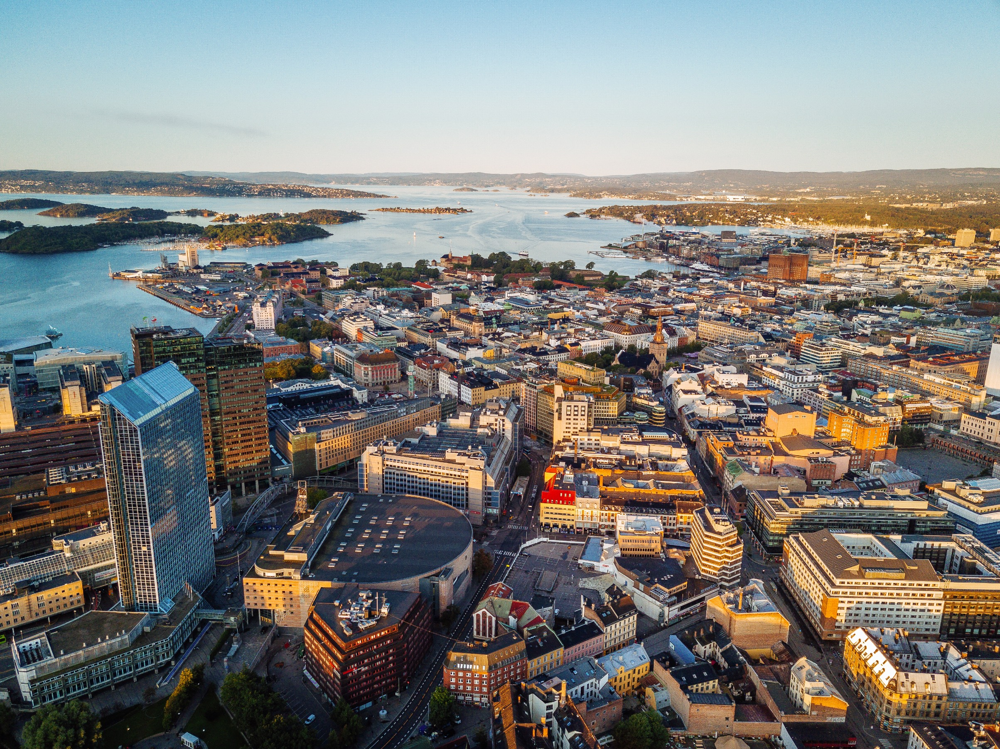

  
  
  
  

## Kjære velger, 

  
Som Oslos liberale parti kjemper vi for å gi hvert enkelt menneske
størst mulig frihet, samtidig som vi tar vare på naturen og hverandre.
Vår visjon er en grønnere, friere og rausere by. Det er utgangspunktet
for dette programmet. Vi skal gjøre Oslo til en foregangsby i klima- og
miljøpolitikken. Da må det bli enklere og billigere å ta miljøvennlige
valg i hverdagen. Derfor vil Venstre ha billigere og bedre
kollektivtransport, og gjøre byen mer tilgjengelig for syklister og
gående. Samtidig skal vi stanse nedbyggingen av natur, og ta vare på
Marka, parkene, elvene og Oslofjorden.   Det skal være trygt og godt å
vokse opp i Oslo. Som liberale er vi opptatt av å gi barn og unge en
utdanning og oppvekst som skaper like muligheter for alle. Venstre
satser på skolen fordi kunnskap er nøkkelen til å løse utfordringene vi
står overfor og utjevne sosiale forskjeller. Slik danner vi grunnlaget
for at folk kan leve frie og gode liv.   Noe av det beste med Oslo er at
vi har kultur for enhver smak, sjarmerende butikker og kulturbygg i
verdensklasse, store smaksopplevelser og små nabolagskafeer, brennende
idrettsglede og steder å nyte roen. Derfor heier vi på ildsjeler som
beriker byen, på et fritt og mangfoldig kulturliv og på dem som vil
skape en arbeidsplass for seg selv og noen til. Vi vet at Oslo blir best
når alle gode krefter bidrar og kommunen spiller på lag med
næringslivet, frivilligheten og innbyggerne.    Oslo skal være en raus
og inkluderende by med plass til alle, uavhengig av bakgrunn, legning,
livssyn, kjønn, alder, funksjonsevne og livssituasjon. Derfor er Venstre
opptatt av å stå opp for de som trenger det mest. Vi skal bekjempe
fattigdom og rasisme, og stille opp for sårbare grupper som i altfor
lang tid har blitt møtt av det offentlige med moralisme og stengte
dører. I en tid der liberale verdier er under stort press, både i Norge
og i resten av verden, trengs et parti som står opp for frihet og
fellesskap, mot enkle populistiske løsninger. Når du velger Venstre er
du med på å støtte opp om de liberale verdiene. Vi håper du vil bli med
på laget.   Godt valg\!  
  
  

## Klima og miljø

  
Verden står midt i en klima- og naturkrise. Venstre vil at Oslo skal
være en nasjonal og internasjonal pådriver for gjennomføring av
klimakutt som monner, og en by som tar vare på natur og dyreliv. Oslo må
gå foran og vise at grønn omstilling er mulig, uten at det går på
bekostning av innbyggernes livskvalitet eller frihet. Det kan inspirere
andre byer i inn- og utland, slik at den globale omstillingen går
raskere.  Det å bo i en by som Oslo er bra for både klima og miljø.
Derfor er det også bra at flere ønsker å bli Osloborgere. Vår visjon er
å skape en by der det er lett for folk å ta miljøvennlige valg, der vi
tar vare på det biologiske mangfoldet og kraftig reduserer
klimagassutslippene.   

## En klimavennlig hovedstad

  
Oslo skal være i forkant med å kutte utslipp, og nå haster det. Oslo må
være en nullutslippsby innen 2030. Transport, avfall og bygg og anlegg
står for nesten alle utslipp i Oslo. Derfor må hovedinnsatsen legges
her.  Bevaring, restaurering og reetablering av natur er avgjørende
klimatiltak. Det bidrar til reduserte utslipp og gjør oss bedre rustet
til å håndtere klimaendringene. Venstre mener at vi må være bevisste på
vårt globale klimaavtrykk og indirekte utslipp, og at vi må tenke på
hvilke konsekvenser valgene vi tar i Oslo har for klimaet i resten av
verden.   

### Gamle Oslo Venstre vil:

  
- At all transport i Oslo skal bli utslippsfri så raskt som mulig.  
- Redusere biltrafikken med en tredjedel innen 2030, og kun tillate nysalg
av nullutslippsbiler fra 2025. 
- Øke produksjonen av fornybar energi i
Oslo-området. 
- Bygge ut flere, og utvide eksisterende flere, og utvide
eksisterende miljøvennlige fjernvarmenett for oppvarming. 
- At det
stilles strenge klima- og miljøkrav når nye større utbyggingsområder
32  
planlegges.  
  
- At byggeplasser i kommunen blir utslippsfrie. 
- At klimagevinsten i
rehabilitering, fremfor riving, alltid skal vurderes i kommunale
eiendomsprosjekter. 
- Stille krav til ombruk og gjenbruk av materialer i
alle kommunale byggeprosjekter. 
- Fullføre karbonfangstanlegget på
Klemetsrud.  
- Vurdere karbonfangst for avfallsanlegget på Haraldrud. 
- Stille krav om energiproduksjon og vegetasjon på tak og fasader i nye
større bygg, for å bidra til klimatilpasning og økt biologisk mangfold.
- Bygge ut kombinasjonsanlegg for hurtiglading av elbiler- og båter
langs Oslofjorden, for å sikre lønnsomhet også utenfor båtsesongen.  
- Stille krav om landstrøm til alle cruiseskip og ferger som ankommer
Oslo, og fjerne cruiseterminalen fra sentrum 
- Gjøre det enklere å selge
strøm fra solceller og annen lokal produsert energi til nettet.  

## Grønt hverdagsliv og sirkulær økonomi

  
Å ta vare på miljøet handler om å ta ansvar, men det det handler også om
å gjøre Oslo til en bedre by å bo i. En grønn by, der det er enkelt og
billig å leve miljøvennlig, er en god by å bo i. Å gå, sykle og å reise
kollektivt skal alltid være det rimeligste og beste alternativet.
Nordmenn ligger på verdenstoppen i forbruk per innbygger. For å redusere
belastningen som følge av forbruk og avfall, må vi legge til rette for
økt gjenbruk av materialer og deling av ressursene. Venstre vil derfor
gjøre det enklere og mer attraktivt å dele, gjenbruke, ombruke og
resirkulere.  

### Gamle Oslo Venstre vil:

  
- Prioritere fotgjengere, sykkel og kollektivtransport foran
privatbilisme. 
- Styrke kollektivtilbudet og bedre
sykkeltilretteleggingen, spesielt i ytre by.  
- Sørge for bedre og
tryggere sykkelparkering i hele byen, særlig ved kollektivknutepunkt. 
- Gjøre bildelingsordninger mer tilgjengelig med flere reserverte
parkeringsplasser og flere ladeplasser.  
  
- Innføre flere effektive tiltak for å redusere svevestøv, blant annet
fra vedfyring og piggdekk. 
- Sørge for at alle har en park eller et
grøntområde i gangavstand fra sin bolig.  
- Utvide og tilgjengeliggjøre
Oslo kommunes støtteordninger for klimatiltak og energisparing i
borettslag, sameier og næringsbygg.  
- Sikre friheten til å velge
fullverdige veganske og vegetariske alternativer i kommunens kantiner og
institusjoner. 
- Gjøre det enklere for Oslofolk å sortere og resirkulere
avfall, blant annet ved å utvide åpningstidene ved gjenbruksstasjonene.
- Stille krav om at næringslivet kildesorterer alt avfall. 
- Få slutt
på overfylte søppeldunker ved å erstatte dem med smartere og mer
innovative avfallsbeholdere. 
- Sikre et bedre tilbud for innsamling,
gjenbruk og gjenvinning av tekstilavfall. 
- Stille krav om at kommunale
virksomheter alltid skal vurdere gjenbruk ved anskaffelse av materiell,
som møbler, tekstiler osv.  

## En klimatilpasset by

  
Selv i en verden som når utslippsmålene i Parisavtalen, vil vi oppleve
klimaendringer. Allerede nå opplever vi kortere vintre og mer
ekstremvær. Derfor må vi tilpasse Oslo til et hardere klima. De mest
effektive tiltakene er å gi mer plass til grøntområder og å åpne flere
vannveier. En grønn by forberedt på klimaendringer er god å bo i, gir
rom til biologisk mangfold, beskytter mot flom, renser luften og
regulerer lokalklima.   

### Gamle Oslo Venstre vil:

  
- Reetablere, restaurere og etablere mer natur i hele byen for å kutte
utslipp, ta vare på det biologiske mangfoldet og styrke beredskapen mot
ekstremvær. 
- Styrke overvannsstrategien og øke tempoet i gjenåpningen
av elver og bekker som er lagt i rør. 
- Innføre en støtteordning for
etablering av grønne tak og vegger på eksisterende bygg og for
naturdekke i bakgårder i borettslag og sameier.  
  
- Åpne for hurtig omregulering av gateareal og parkeringsplasser for å
gi plass til fortaushager og mikroparker.  

## Mer natur i byen

Naturmangfoldet på jorda er under voldsomt press, og tap av natur bidrar
til økte klimagassutslipp. Den viktigste årsaken er at natur må vike for
bygninger og vei. Natur beskytter oss mot konsekvensene av
klimaendringer og ekstremvær og vi er helt avhengige av naturen for å få
rent vann, ren luft og stabil matproduksjon. Oslo Venstre vil derfor
stanse nedbyggingen av naturen og få mer natur i byen, ta vare på
naturmangfold og reetablere og restaurere natur som er blitt ødelagt.  

### Gamle Oslo Venstre vil:

  
- La naturen få være i fred ved at all ny byutvikling foregår i allerede
båndlagt areal, gjennom et mål om arealnøytralitet  
- Forsvare
Markagrensa. 
- Innføre en Parkagrense etter modell av Markagrensa for å
gi parker, grøntområder og annen natur i byen et sterkere vern. 
- Ta
vare på og styrke naturen i all byutvikling. 
- Etablere nasjonalpark i
Østmarka. 
- Etablere flere “parkgater” i indre og ytre by, der asfalt
og betong omgjøres til mikroparker med trær og natur. 
- Stille krav om
at alle nye byutviklingsprosjekter bidrar til at Oslo får mer natur og
grøntområder. 
- Opprette flere vernede soner i Marka og sikre at all
skogsdrift i Marka skjer på en skånsom måte, for å fremme biologisk
mangfold og beskytte sårbare økosystemer mot flatehogst. 
- Tilrettelegge
for et mangfoldig aktivitets- og friluftsliv i Marka.  
- Kartlegge
arealer som ligger brakk for å restaurere og reetablere mer natur. 
- Bevare ulv i hele ulvesonen, inkludert i Marka, for å være med på å
sikre en levedyktig, sunn ulvestamme i Norge. 31  
- Fjerne miljøgifter på gamle industritomter.  
  
- Styrke vernet av trær, plante flere trær og stille krav om at
utbyggere planter flere trær når nye bygg oppføres, og at stedsegnede
arter i større grad brukes. 
- Oppgradere byens grøntområder og bevare
100-meterskogene. 
- Styrke vernesonen rundt Østensjøvannet
naturreservat, og arbeide for etablering av bynasjonalpark på
eksisterende naturområder ved Maridalen, Akerselva miljøpark, Bygdøy,
Hovedøya, Ekebergskrenten, Alna miljøpark og Østensjøvannet 
- Etablere
flere nye folkeparker med natur, idrettstilbud og anlegg for rekreasjon
og breddeidrett blant annet i Bestumkilen. 
- Legge til rette for mer
urbant landbruk. 
- Redusere bruken av veisalt, særlig i områder der det
skader trær og planter, og etablere flere fortau med varme i bakken i de
mest brukte bygatene. 
- Aktivt bekjempe etablering og spredning av
svartelistede planter, som blant annet kanadagullris, kjempebjørnekjeks.
- Redusere lysforurensing i Oslo, blant annet gjennom krav ved
regulerings- og oppgraderingsarbeid.  

## Ren og levende Oslofjord

  
I løpet av de siste 30 årene har Oslofjorden endret seg dramatisk. Fra å
være en fjord full av fisk og sjøfugl, har bestandene av nøkkelarter som
torsk og hummer gått ned med over 90 prosent. Heldigvis er det ikke for
sent å snu utviklingen, men det krever en storstilt og koordinert
redningsaksjon. Venstre vil at Oslo skal gå foran i arbeidet med å ta
vare på Oslofjorden, slik at også fremtidige generasjoner får oppleve en
levende og frisk fjord.  

### Gamle Oslo Venstre vil:

  
- Øke rensegraden på Oslos avløpsvann og kloakk. 
- Drastisk redusere
Oslos bidrag til forurensing av Oslofjorden og arbeide for fosfor- og
nitrogengjenvinning langs hele fjorden. 
- Kutte tilførselen av plast og
annen forsøpling til Oslofjorden, blant annet ved mindre bruk av plast
og engangsartikler.  
- Innføre større vernesoner i Oslos del av
Oslofjorden der all fangst og fiske er 32  
forbudt frem til et sunt liv i fjorden er gjenopprettet.  
  
- Jobbe for et forbud mot bunntråling i Oslofjorden for å redusere den
totale belastningen på det marine økosystemet. 
- Gjennomføre piloter for
å styrke livet på havbunnen, med bygging av rev og ålegrasenger i indre
Oslofjord. 
- Innføre forbud mot tømming av septik fra fritidsbåter i
sjøen senest i 2023 og anlegge flere mottaksanlegg for septik fra
fritidsbåter. 
- Stille krav til småbåthavnene om å kutte all tilførsel
av forurensing og plast til fjorden. 
- Gjøre Oslo til forsøksby for
erstatning av engangsartikler med gjenbruksløsninger, blant annet til
take-away. 
- Etablere et eget Oslofjord-prosjekt, som skal koordinere
kommunens innsats og samarbeid med andre Oslofjord-kommuner. 
- Gi folk
bedre tilgang til fjorden og øyene som friområder.   
  
  

## Byutvikling  

  
Oslo skal være en mangfoldig by med ulike kvaliteter, gode boliger og
trygge nabolag. Alle skal ha tilgang og nærhet til grøntarealer,
kultur-, service- og tjenestetilbud og et attraktivt og klimavennlig
transportsystem. Vi skal skape et nullutslippssamfunn gjennom en
målrettet og helhetlig byutvikling, der vi tar vare på naturen, fjorden
og byens blågrønne preg.  

## En grønn by med plass til alle 

  
Oslo trenger flere ulike boligtyper over hele byen, og vi må stille
strenge kvalitetskrav både til bolig og uteareal. Vi ønsker oss en
10-minuttersby, der innbyggere har hverdagstjenester, som skoler,
barnehager, parker og fritidstilbud innenfor ti minutters gange. Slik
kan Oslo bli en enda bedre by å bo i, men mindre sosial ulikhet, både
mellom ulike deler av byen og mellom generasjoner.  

### Gamle Oslo Venstre vil:

  
- Tilstrebe at alle skal ha tilgang til grøntareal og hverdagstjenester,
som butikker, barnehager, skoler og andre kommunale tilbud maksimalt 10
minutters gange fra der de bor. 
- Bevare Markagrensa og etablere
Parkagrensa, som beskytter og bevarer grønne områder i byen. 
- Stille
krav om at alle nye byutviklingsprosjekter bidrar til at Oslo får mer
natur og grøntområder. 
- Sikre at alle barn som vokser opp i Oslo får
plass i gode barnehager og skoler med gode uteareal i trygg gangavstand.
- Sikre variasjon i boligtyper over hele byen, slik at de som ønsker å
bo i Oslo finner boliger som dekker deres behov.  
- Bygge flere boliger
blant annet gjennom fortetting ved knutepunkter og transformasjon fra
industri- til boligområder. 
- Ta tomme kommunale bygg i bruk, og sørge
for at bygg som er eid av Oslo kommune blir utnyttet til det beste for
innbyggerne, enten ved at de utvikles av 32  
kommunen eller selges.   
  
- Styrke attraktiviteten og bedre bokvaliteten i hele byen, blant annet
gjennom å fjerne barrierer som trafikk, høyspentledninger og industri-
og logistikkbygg. 
- At det offentlige rom utformes menneskevennlig og
universelt, med beplantning, gode bymøbler og muligheter for
aktivitet.  

## Nye byutviklingsområder

  
Mange ønsker å bo i Oslo, og byen trenger flere boliger for å dempe
prispresset. Mange byområder har et stort potensial for utvikling, uten
at det går ut over natur eller vernehensyn. Venstre ønsker å prioritere
byutvikling i områder tilknyttet kollektivknutepunktene og gamle
industri- og havneområder. På denne måten kan byen utvikles, uten at det
øker transportbehovet og uten at det går på bekostning av
naturområder.  

### Gamle Oslo Venstre vil:

  
- Dempe prispresset i boligmarkedet ved å effektivisere
reguleringsarbeidet. 
- Gi insentiver til bygg med betydelige klima- og
miljøgevinster med lavere byggesaksgebyrer og prioritet i
reguleringsarbeidet.  
- Sørge for at det tidlig utvikles god
kollektivdekning i nye utviklingsområder, og at gående, syklende og
kollektivtransport blir prioritert. 
- Ta vare på naturen i all
byutvikling, og sette mål om arealnøytralitet ved å gjenbruke og
fortette allerede utbygde arealer fremfor å bygge ut mer natur.  
- Sørge
for at etablering av skoler, barnehager, grøntområder og andre sosiale
tilbud sikres tidlig i prosjektutviklingen av nye byutviklingsområder. 
- Forenkle regulering på mindre tomter i den tette byen og tilrettelegge
bedre for infill-prosjekter. 
- Sørge for at Filipstad blir et levende
byområde med ulike typer boliger, tilgjengelige og attraktive offentlige
byrom og et variert handels-, service- og tjenestetilbud. 
- Styrke
bomiljøet i Groruddalen gjennom å bygge ned barrierer som trafikk,
høyspentledninger og industriområder.  
- Frigjøre areal til boliger og
lokalt næringsliv ved å effektivisere og flytte deler av 32  
virksomheten ved Alnabruterminalen.  
  
- At høyhus som hovedregel skal bygges på tomter som ligger tett på
større kollektivknutepunkt, og med krav om at de skal bidra til
vesentlige forbedringer på bakkeplan med publikumsrettede tilbud, gode
offentlige rom og nabolag. 
- Sikre et sterkt vern av småhusområder og
strøk av historisk betydning.  
- Samarbeide med grunneiere, næringsliv
og innbyggere om økt byliv i hele Oslo. 
- Samlokalisering av ny
fergeterminal:  

## Alternativ 1:

Prioritere klima, miljø og dyreliv når alternativer til fergeterminal og
annen havnevirksomhet skal vurderes, samt stille krav om god byutvikling
og økt tilgjengelighet til fjorden, ved at en ny fergeterminal
samlokaliseres på Vippetangen.  

## Alternativ 2:

Prioritere god byutvikling, økt tilgjengelighet til fjorden og
naturrestaurering, samt stille krav om at klima, miljø og dyreliv
ivaretas, ved at en ny fergeterminal samlokaliseres på Kongshavn.  

## Alternativ 3:

Fullføre Fjordbyen for å frigjøre mer areal langs fjorden. For Venstre
er det viktigste at fergeterminalene blir samlokalisert på ett sted. I
vurderingen av framtidig plassering må hensynet til både klima,
byutvikling, miljø, tilgjengelighet til fjorden og naturrestaurering
vektlegges.   

## Boliger for alle 

  
Byen har et stort underskudd av boliger, som skaper stadig høyere
priser. Det er for vanskelig for nye kjøpere å komme seg inn i
boligmarkedet. Vårt svar på boligutfordringen er å bygge ut de gamle
industri- og havneområdene til nye byområder, fordi det er her det store
potensialet for boliger ligger. Det neste store byutviklingsprosjektet i
Oslo bør være en utvikling av områdene langs Alnaelva og Hovinbekken til
en moderne og levende bydel, med boliger, kultur og næring.     
  
  

### Gamle Oslo Venstre vil:

  
- Sikre at det reguleres ferdig 5000 boliger av høy kvalitet hvert år. 
- At nye boliger primært bygges ved kollektivknutepunkt og i gamle
industri- og havneområder, ikke gjennom nedbygging av natur. 
- Samarbeide med boligaktører om alternative kjøpsmodeller som hjelper
flere inn på markedet som for eksempel deleie og leie-til-eie-modell. 
- Gjøre kommunal saksbehandling av plansaker mer effektiv, digital og
inkluderende, for å sikre raskere boligbygging, mer forutsigbarhet for
utbygger og bedre medvirkning for innbyggerne.  
- At det stilles krav
til høy bokvalitet i nye boliger, med godt dagslys, utsyn, tilgang til
gode private og felles utearealer. 
- Prioritere å behandle
reguleringssaker for studentboliger og de mest miljøvennlige
boligene.   

## Gode og levende nabolag

  
Mange boligområder i Oslo mangler naturlige møtesteder, har for dårlig
internt kollektivtilbud og er dårlig tilrettelagt for at folk kan gå
eller sykle. Venstre vil invitere med folk og næringsliv til å
videreutvikle sine nabolag og styrke lokalsamfunnene. Vi vil etablere
lokale “nabolagssoner” som er møteplasser i folks nabolag, med flere
grøntområder og et godt service- og tjenestetilbud. Det må også bli
lettere å reise miljøvennlig internt i alle bydeler.  

### Gamle Oslo Venstre vil:

  
- Etablere lokale ”nabolagssoner”, som legger til rette for
sosialisering og lokal tilhørighet.  
- Opprette en søknadsbasert
støtteordning for lokale nabolagssoner, og sikre at nabolag blir
utviklet i samarbeid mellom kommunen, innbyggerne og lokalt næringsliv. 
- Etablere flere trygge møteplasser, tilrettelagt for sosial aktivitet
for alle aldersgrupper.  
- Tilrettelegge for at flere offentlige og
private bygg kan brukes av lokale lag og 30  
foreninger på ettermiddager og kvelder.  
  
- Sørge for at det utvikles velfungerende byområder nært byens
knutepunkter, med boliger, tjenestetilbud og lokalt næringsliv.  
- At
byen skal være ren og at offentlig tilgjengelig areal skal være godt
vedlikeholdt, både på privat og offentlig grunn. 
- Redusere
støyforurensing fra blant annet vei- og byggeaktivitet.  
  
  

## Grønn transport

  
Venstre vil sørge for at alle raskt, enkelt og rimelig kan komme seg
rundt i byen på en miljøvennlig måte, og vi vil alltid være en garantist
for et bedre og billigere kollektivtilbud. Byutviklingen må skje på en
måte som utnytter grønn transport mest mulig effektivt, gjennom å skape
attraktive byområder med arbeidsplasser, boliger og tjeneste- og
servicetilbud i gangavstand til de største kollektivknutepunktene.Vi må
redusere behovet for privatbilen for å redusere arealbruk, forurensing
og utrygge situasjoner.   Oslos transportsystem skal være det mest
miljøvennlige i Europa. Da må vi både prioritere mer og bedre
tilrettelagt areal for gående og syklende, samtidig som  kollektiv-,
personbil- og varetrafikken må være utslippsfri. Det betyr også at den
totale biltrafikken må ned.    

## Gå- og sykkelbyen Oslo

  
Venstres mål er å skape en by der gående og syklende føler seg trygge i
trafikken hele året, uavhengig av utgangspunkt. For mennesker med ulike
funksjonsvariasjoner er Oslo fremdeles i stor grad en utilgjengelig by,
uten universell tilrettelegging, og det skjer for mange ulykker. For
mange steder er byen er utformet på bilens premisser, med fysiske
barrierer og plassbegrensninger for myke trafikanter. Vi vil styrke
gang- og sykkelaksene, særlig i ytre by, og sørge for at indre by har et
finmasket nett av bilfrie gater. Rundt skoler og barnehager vil vi
opprette bilfrie soner, der barn fritt kan ferdes trygt og på
egenhånd.   

### Gamle Oslo Venstre vil:

  
- Gjøre det enklere og tryggere å gå, gjennom å utvikle en egen
“Oslostandard” for gående, med fokus på en tryggere og mer komfortabel
hverdag til fots.  
- Nedskalere Ring 1 og støtte løsningen om at kun
kollektivtransport og støtte løsningen om at kun utrykningskjøretøy kan
kjøre gjennom Hammersborgtunnelen.  32  
- At over halvparten av alle hverdagsreiser skal tas med sykkel og
gange.  
  
- Opparbeide flere fortau, snarveier og gangveier. 
- Etablere flere
gågater og bilfrie soner, i flere bydeler, blant annet en
sammenhengende gågate fra Kvadraturen til Grünerløkka, Ruseløkkveien og
i deler av gata Grønland for å skape mer byliv. 
- At Oslo sentrum i så
stor grad som mulig skal være fritt for privatbilisme, men tilrettelagt
for HC og varelevering. 
- Redusere hastigheten for personbiler i alle
gater og veier med blandet trafikk. 
- Bedre fremkommelighet og trygghet
for myke trafikanter gjennom å ta i bruk flere virkemidler for å
begrense de tyngste lastebilenes tilgang til sentrum og legge
tidspunktene for varelevering til utenom rushtiden. 
- Sikre at hensynet
til gående og syklende ivaretas når bygg- og anleggsarbeid pågår. 
- Jobbe for at alle offentlige områder i Oslo blir universelt utformet. 
- Sikre alle barn trygge skoleveier, ved at alle skoler blir en del av
hjertesonearbeidet.  
- Få fart på utbyggingen av sykkelveinettet i hele
byen.  
- Oppgradere sykkelinfrastrukturen, skjerme syklistene fra
biltrafikk, og koble sammen dagens infrastruktur til et sammenhengende
sykkelveinett. 
- Etablere eller oppgradere minst 100 km sykkelvei innen
2027. 
- Styrke Oslos sykkelstrategi og sette separate mål og virkemidler
for indre og ytre by.  
- Innføre gratis bysykkel for ungdom og
studenter. 
- Sikre at sykkelveier, fortau og gågater prioriteres når
veier måkes for snø om vinteren, og innføre børsting av sykkelveier som
standard, fremfor salting som sliter veldig på syklene. 
- Sikre bedre
samspill mellom elsparkesykler og andre trafikanter gjennom å definere
soner med lav hastighet, dedikerte parkeringssoner og parkeringsfrie
soner. 
- Arbeide for flere tilgjengelige bysykler, elsparkesykler og
elsykler i hele byen, også utenfor indre by. 
- Etablere flere trygge
sykkelparkeringsanlegg, og etablere servicestasjoner for 32  
sykler der det også er tilbud om lading for elsykler, i alle bydeler.   
  
- Støtte tiltak som får flere til å velge sykkel, som sykkelkurs og
sykkelvennlig arbeidsplass.  

## Kollektivtransport

  
Venstre vil fortsette å være den sterkeste forkjemperen for at
kollektivtrafikk i byen vår skal være rimelig, ha hyppige avganger og nå
ut til flest mulig. Det handler om at skal komme deg dit du skal på en
god og miljøvennlig måte. Vi vil få tilbudet og passasjertallet opp, og
billettprisene og utslippene ned.   

### Gamle Oslo Venstre vil:

  
- Ha en makspris på 600 kroner i måneden for kollektivt internt i Oslo,
med halv pris for ungdom, elever og studenter. Barn skal reise gratis. 
- Tilby nye og mer fleksible billettyper, som sørger for at passasjerene
alltid er sikret den billigste billettypen.  
- Videreutvikle og utvide
Ruters tjenester, som ordningen med aldersvennlig transport, slik at
tilbudet i enda større grad møter folks behov i hverdagen. 
- Fullføre
Fornebubanen, og sikre god byutvikling i tilknytning til stasjonene på
strekningen. 
- Bygge nytt signal- og sikringsanlegg for t-banen for å
sikre hyppigere avganger og flere t-banetog gjennom sentrumstunnelen. 
- Styrke Ruters tilbud på tvers innen og mellom bydeler utenfor
sentrumsnære områder. 
- Øke kapasiteten og hyppigheten på t-banelinjene
i Groruddalen. 
- Bygge nye Majorstua stasjon, og sørge for en
byutvikling på stasjonsområdet som både gir nye boliger, handels- og
tjenestetilbud, samt inntekter til kommunen. 
- Forlenge trikkelinjene
fra Sinsen til Tonsenhagen og fra Majorstua og langs Ring 2. 
- Sørge for
økt finansiering til kollektivprosjekter og sykkeltilrettelegging,
gjennom å kreve økt statlig bidrag, økte, men mer forutsigbare
grunneierbidrag, mer bykassemidler og bompenger. 
- Samarbeide med
nabofylket og nabokommuner om samferdsel og kollektiv, blant 31  
annet gjennom Oslopakke 3.  
  
- Gjennomføre kraftfulle tiltak for å bedre fremkommeligheten for trikk
og buss i Oslo. 
- Utvide kollektivtilbudet på nattestid. 
- Sikre at
buss- og trikkestopp ligger i gangavstand til boligområder, samt
handels- og tjenestetilbud.  
- Sikre at alle, uansett
funksjonsvariasjon, skal kunne benytte kollektivtilbudet.  
- Utvide
ordningen med TT-kort, med flere reiser og lavere priser.  

## En miljøvennlig bilpolitikk

  
Den raske fremveksten av elbiler løser mange av miljøproblemene med
biltrafikk, men ikke trafikkproblemer og støy eller svevestøv. Venstre
vil derfor redusere den totale biltrafikken i Oslo, og samtidig legge
til rette for en rask elektrifisering av bilparken og nyttetrafikken.
Det skal alltid lønne seg å velge de mest miljøvennlige bilene.   

### Gamle Oslo Venstre vil:

  
- Innføre nullutslippssoner der det kun er lov å kjøre med kjøretøy som
bruker elektrisitet eller biogass. 
- Redusere behovet for bruk av bil i
hverdagen, og tilrettelegge for at de som trenger bil har tilgang til
ladeinfrastruktur og bildelingsordninger. 
- Kraftig øke antallet
offentlig tilgjengelige hurtig- og lynladere for elbiler pr. år for å
holde tritt med veksten i antall elbiler. 
- Øke bompengene for å sikre
finansiering til tiltak for gående, syklende og kollektivreisende. 
- Sikre at det alltid er minimum 50 % billigere for elbiler enn
fossilbiler i bomringen. 
- Innføre høyere bompenger for tyngre
kjøretøy.  
- Gå mot store nye motorveiutbygginger som øker
biltrafikken, og kreve høye rushtidsavgifter og prioritering av
kollektiv på eventuelle utbygginger. 
- Redusere mengden tungtransport i
Groruddalen. 
- Redusere miljøbelastningen fra veitrafikk og øke
fremkommelighet for kollektivtrafikk i Oslo øst gjennom å realisere E6
Oslo Øst-prosjektet med 31  
Manglerudtunnelen, Fossumdiagonalen og nedskalering av RV 4
Trondheimsveien.  
  
- Gjennomføre ombyggingen av Trondheimsveien for å redusere støy og
forurensing. 
- Få fart på arbeidet med mer klimavennlig og koordinert
varelevering i indre by, slik at vi reduserer bilkjøring og utnytter
kapasitet i kjøretøy bedre. 
- Etablere fyllestasjoner for hydrogen på
egnede steder når antall hydrogenkjøretøy øker.  
- At Oslo skal overta
ansvaret for utforming av alle veier for lokaltrafikk fra Statens
Vegvesen, inkludert Trondheimsveien, Mosseveien, Østre Aker vei,
Nylandsveien, Ring 1 og Ring 3, for å skape nye gode bygater. 
- Redusere
biltrafikk i belastede boligområder, også i ytre by, som på Røa 
- Etablere flere HC-plasser i byen og tillate biler med HC-kort og taxier
for TT-  
kjøring å kjøre i kollektivgater i indre by.  
  
  

## Utdanning og oppvekst   

  
Venstre vil sikre en god oppvekst med like muligheter for alle barn og
unge. Da må alle barn ha gode barnehager og skoler, trygge nærmiljø og
reelle muligheter til å delta på idretts- og fritidsaktiviteter. En god
skole er en skole som tar hensyn til at vi er forskjellige. Vårt mål er
å skape en Osloskole som ser alle elevene, og som makter å tilby
mestring og læringsglede til alle elever. Vi trenger derfor et friere og
mindre rigid utdanningssystem. Lærere må ha et bredt lag rundt seg,
metodefrihet og tid til å følge opp elevene. Samtidig må elevene få
større innflytelse over egen skolehverdag.  Først og fremst er det
trenger Osloskolen et større økonomisk handlingsrom. Derfor vil Venstre
gi mer penger til Osloskolen.  

## Barnehage

  
Å ikke få plass i en barnehage i nærheten av der du bor eller jobber,
byr på utfordringer for mange av oss. Det er et kapasitetsproblem som må
løses. Ingen familier er like, og barn har ulike behov. Derfor ønsker
Venstre et mangfold i barnehagetilbudet i Oslo, slik at familier kan
velge et tilbud som passer for dem. Kvaliteten på barnehagene er det som
er viktig, ikke hvem som driver eller eier barnehagene. Venstre vil
sørge for utbygging av flere private og kommunale barnehageplasser, og
sette familienes behov først.  Kompetanse hos ledelse, lærere og
ansatte, gode inne- og utemiljø og nok voksne er helt avgjørende for
barna. Kvaliteten på barnehagene i Oslo varierer, og enkelte barnehager
har for lav voksentetthet eller for lav kompetanse blant de ansatte.
Venstre vil aldri gå på kompromiss med kvalitet.   

### Gamle Oslo Venstre vil:

  
- At alle skal ha mulighet til å få plass i en barnehage i sitt
nærmiljø. 
- Sikre kvalitet i kommunale og private barnehager.  
- At
barnehager skal ha nok kompetente ansatte, oppfylle pedagog- og 32  
bemanningsnormen, ha leder tilstede og vikarer ved behov.   
  
- Bevare foreldrenes frihet til å velge barnehage, og behandle private
og offentlige barnehager likeverdig. 
- Gjennomføre løpende opptak til
barnehager, for å sikre at barna får rett på plass i barnehage når
permisjonen er ferdig.  
- Slutte å bruke penger på å kjøpe opp nye og
velfungerende, private barnehager for å åpne dem i kommunal regi.  
- Legge til rette for et mangfoldig tilbud, slik at foreldre kan velge
barnehageplass også ut fra barnehagens profil. 
- Øke andelen ansatte med
formell kompetanse gjennom rekruttering og tilbud om etterutdanning. 
- Styrke lederutdanning for barnehagene.  
- Åpne for kveldsåpne
barnehager, kombinert med makstid per døgn og uke.  
- Sikre god og
næringsrik mat i kommunale barnehager.  
- Forbedre overgangen fra
barnehage til skole, bl.a gjennom å sikre felles kartlegging og
overgangssamtaler.  
- Ruste opp barnehagebygg og uteareal, sikre nye
lekeapparater i barnehagene og hente inn vedlikeholdsetterslepet. 
- Styrke opplæring for barn om egen helse og seksualitet fra og med
barnehagen.  

## Barneskole

  
Skolen er det viktigste virkemiddelet vi har for å lykkes med å utjevne
sosiale forskjeller. En god start på skolegangen er avgjørende for å
lykkes senere i utdanningsløpet. Derfor er grunnskolens viktigste
oppgave å gi alle elever de forutsetningene de trenger for å oppleve
mestring. Tidlig innsats er avgjørende for å sikre alle grunnleggende
ferdigheter. Venstre ønsker flere tydelige virkemidler for å gi
tilpasset opplæring for elever med ulike forutsetninger og behov.   

### Gamle Oslo Venstre vil:

  
- Prioritere tidlig innsats konsekvent, blant annet gjennom etablering
av et sentralt kompetanseteam på lesing, skriving og regning som kan
bistå skolene.  
- Legge til rette for et mer fleksibelt skoleløp, ved å
fremskynde eller utsette 32  
skolestart samt hospitere hos andre klassetrinn.   
  
- Sikre at barn som trenger det får spesialundervisning, og prøve ut
flere modeller for kvalitet i det spesialpedagogiske tilbudet 
- Etablere
flere plasser på spesialskolene med og styrke samhandling med
nærskolen.  
- Sikre at religiøse og kulturelle normer ikke hindrer
barns deltakelse i undervisning, samtidig som det religiøse og
kulturelle mangfoldet blant elevene blir respektert. 
- Styrke kompetanse
på bruk av digitale og analoge læremidler i skoleløpet. 
- Styrke tiltak
som sikrer tilhørighet til nærskole for barn med spesielle behov.  
- Sørge for grunnleggende svømmeferdigheter hos alle barn i løpet av
barneskolen.  
- Styrke tilbudet til tilpasset opplæring for elever med
høyere læringspotensial. 
- Innføre andre fremmedspråk fra femte klasse
og gi flere valgmuligheter enn i dag.  
- Utvikle en bemanningsnorm for
PP-tjenesten, og starte opp prosjekter med fast PPT-tilstedeværelse på
skoler.  
- Styrke alternative opplæringsarenaer med mulighet til
praktisk læring og entreprenørskap. 
- Styrke skolebibliotektjenesten ved
å ha gode innkjøpsbudsjetter, lengre åpningstider og kvalifisert
personale på alle skolebibliotek. 
- Sikre likeverd ved å fjerne
religiøse samlinger i regi av den offentlige skolen.  

## Aktivitetsskolen

  
Aktivitetsskolen (AKS) er et viktig tilbud, og det bør derfor være
tilgjengelig for flere. Selv om Oslo er kommet langt i arbeidet med å
sikre alle barn mulighet til å delta, er det fortsatt elever som av
ulike årsaker holdes utenfor fellesskapet. Økonomi skal ikke være til
hinder for deltagelse. Kvaliteten på tilbudet i AKS må styrkes og det må
legges opp til samarbeid med aktører utenfor skolen, der det bidrar til
å øke kvaliteten på tilbudet.    

### Gamle Oslo Venstre vil:

  
- Sikre like muligheter for deltagelse i Aktivitetsskolen ved å gi
gratis halvdagsplass til alle elever i Osloskolen. 
- Gi søskenmoderasjon
til familier som har barn både i barnehage og aktivitetsskole. 
- Sikre
og utvikle fag- og lederkompetanse hos AKS-ledelsen.  
  
- Gi barn en variert hverdag og lokal inkludering ved å utvikle modeller
for samarbeid mellom AKS og frivillige organisasjoner, aktører innen
kulturlivet og idrettslag.  

## Ungdomsskolen

  
Det er bekymringsverdig at motivasjonen og læringen til Oslos elever
faller når de starter på ungdomsskolen. Det trengs tiltak for å sikre at
flere fullfører grunnskolen med et godt utgangspunkt for videre
utdanning. Ungdomsskolen skal motivere og engasjere elever til å fordype
seg i fagene og oppdage hvilke interesser og ønsker de har for sitt
liv.   

### Gamle Oslo Venstre vil:

  
- Sikre fokus på fag fremfor prestasjon ved å ha en gradvis innføring av
karakterer på ungdomsskolen. 
- Utvide ordningen med et ekstra år med 11.
klasse eller intensivkurs for de som ikke har bestått fag.  
- Styrke den
tilpassede opplæringen ved å legge til rette for at elever kan få
tilrettelagt undervisning i fag der de ligger på et annet nivå enn eget
klassetrinn.   
- Sikre faglig tilpasning ved å gjøre det enklere å hoppe
over klassetrinn eller gå om igjen, når det vurderes best i tråd med
elevens faglige nivå og utvikling, i samråd med foresatte og eleven
selv.  
- Gjennomføre flere forsøk med alternative vurderingsformer 
- Vurdere prøveprosjekt med profilskoler i grunnskolen, med skoler som
spisser undervisningen inn mot utvalgte tema som realfag, språk, kunst
eller kultur. 
- Stimulere til samfunnsengasjement ved at også
ungdomsskoleelever skal kunne ta ut politisk fravær.   

## Videregående opplæring

  
Den videregående opplæringen er fortsatt preget av for lav
gjennomføringsgrad. For å redusere frafallet er det viktig å styrke
elevenes valgfrihet og muligheten til å påvirke egen skolehverdag og
sørge for alle elever får mulighet til å dyrke og utvikle sine egne
evner og interesser.   
  
  

### Gamle Oslo Venstre vil:

  
- Beholde fritt skolevalg som inntaksmodell for videregående opplæring i
Oslo.  
- Tilrettelegge for mer fleksible skoleløp slik at elever kan
fullføre videregående som privatist, deltidselev, i kombinasjon med jobb
og over lengre eller på kortere tid enn normert.  
- Gjennomføre flere
forsøksordninger med forskjøvet skoledag og fleksitid.  
- Opprette flere
profilskoler, slik at elever får muligheten til å gjennomføre et
skoleløp tilpasset deres evner og interesser.   
- At det skal
reetableres et forsøksgymnas i Oslo, der elevene styrer gjennom
demokratiske prosesser og økt medbestemmelse. 
- Styrke
internasjonaliseringen i skolen ved å tilrettelegge for at flere elever
velger en internasjonal skolegang, som IB eller kommunale
utvekslingsprogrammer.  
- Støtte skoler som ønsker å prøve ut nye
valgfag og fremmedspråk, og være positiv til privat- og friskoler i
Oslo.  
- Utvide ordningen med at videregående-elever skal få muligheten
til å ta enkelte universitetsfag. 
- Jobbe for å avskaffe dagens
fraværsgrense og gå imot nye forsøk på å innføre fraværsregler der
manglende oppmøte kan føre til tap av karakter.   

## Yrkesfag

  
Kompetente fagarbeidere er en akutt mangel i norsk økonomi. Vi trenger
tiltak for å øke rekrutteringen til fagopplæringen og sikre at elevene
gjennomfører opplæringsløpet. Elevene må få tydeligere informasjon,
tettere oppfølgning og muligheter i arbeidslivet. Da er det avgjørende
at alle elever har en læreplass å gå til, eller et annet kvalitetssikret
tilbud som oppfyller deres ønsker og behov..   

### Gamle Oslo Venstre vil:

  
- Styrke kvaliteten på lærlingers opplæring ved å etablere
oppfølgingsansvar i overgangen mellom skole og bedrift. 
- Innføre en
forsøksordning med å fjerne arbeidsgiveravgift for lærlinger for å
stimulere til flere læreplasser.  
  
- Stille krav om flere lærlinger i kommunale anbud og øke inntaket av
lærlinger i kommunale virksomheter.  
- Utvide ordningen med
vekslingsmodellen. 
- Etablere en kommunal mentorordning for elever som
sliter med å kvalifisere seg til læreplass. 
- Sørge for tilstrekkelig og
moderne utstyrsparker ved alle skoler.  
- Finansiere mellomlegget fra
det nasjonale utstyrsstipendet og merkostnaden for kjøp av nødvendig
utstyr til bruk i undervisning. 
- Gjøre skolehelsetjenesten mer
tilgjengelig for Oslos lærlinger gjennom flere ansatte og utvikling av
plattformer for digital skolehelsetjeneste.  

## Lærerne 

  
Kompetente skoleledere og lærere er det aller viktigste for elevenes
læring. Gode skoler kjennetegnes av gode ledere, felles ansvar og
tverrfalig samarbeid der det er tid til å jobbe med tilpasset opplæring.
Kunnskapsrike lærere, som er omgitt av gode og stabile fagmiljø, er
avgjørende for å sikre økt læring og mindre uro i Osloskolen.  

### Gamle Oslo Venstre vil:

  
- Gjøre læreryrket mer attraktivt gjennom flere karrieremuligheter, gode
lønnsbetingelser og mindre byråkrati og papirarbeid. 
- Gi lærere mer tid
til å lære i egne fagmiljø og profesjonelle fellesskap. 
- Styrke
lærerens muligheter til kompetanseutvikling gjennom mer samarbeid med
høyere utdanning. 
- Arbeide for å redusere dokumentering- og
rapporteringskrav for lærere slik at de får mer tid til undervisning og
oppfølging av elever.  
- At kun de med formell rådgivningskompetanse
skal være karriere- eller utdanningsveiledere i Osloskolen.  
- Legge
bedre til rette for at ansatte i skolen kan videreutvikle sin kompetanse
og sine arbeidsoppgaver i skolen.  
  
  

## Skolehelsetjenesten

  
En økende andel unge opplever utfordringer med psykisk helse. De
ungdommene som sliter med psykisk helse, og som søker hjelp hos
skolehelsetjenesten, møter ofte lange køer og en helsetjeneste som ikke
har kapasitet til å tilby den hjelpen ungdommene trenger.
Skolehelsetjenesten trenger derfor et kraftfullt løft.   

### Gamle Oslo Venstre vil:

  
- Styrke skolehelsetjenesten med mål om én ansatt i skolehelsetjenesten
per 250 elever i Osloskolen.  
- Sikre bredere mangfold i
skolehelsetjenesten ved å rekruttere flere menn.  
- Styrke mandatet og
funksjonen til skolehelsetjenesten ved å gi dem mulighet til å
dokumentere fravær.  
- At skolehelsetjenesten i videregående opplæring
skal styres av kommunen sentralt, for å sikre bedre samhandling og
stabil drift.  
- Øke tilgjengeligheten til skolehelsetjenesten ved å
opprette en digital skolehelsetjeneste som et supplement til det fysiske
tilbudet på skolene.  
- Styrke skolehelsetjenesten med flere
yrkesgrupper som psykologer, miljøterapeuter, sosionomer og
idrettspedagoger.  
- Stille krav til formell kompetanse for
helsesykepleiere ansatt i Osloskolen.   

## Læringsmiljø

  
Et godt fysisk og psykisk arbeidsmiljø er avgjørende for en god skole. I
dag går mange elever går på skoler som er gamle, forfalne og trange, og
økt elevtall løses altfor ofte med midlertidige bygg. Samtidig sliter
flere skoler fortsatt med mye vold og uro i elevmassen.Vi må ta igjen
etterslepet på vedlikehold og rehabilitering av skolebyggene i Oslo og
sikre skoler og enkeltelever rask og god hjelp og støtte når det oppstår
vanskelige situasjoner.  

### Gamle Oslo Venstre vil:

  
- Styrke læringsmiljøteamet i Osloskolen, for å sikre god faglig støtte
for lærere og elever, for å sikre god faglig støtte for lærere og
elever. 
- Styrke det tverrfaglige laget rundt læreren ved å ansette
flere yrkesgrupper som 33  
for eksempel miljøarbeidere, psykologer, Nav-veiledere og
minoritetsrådgivere.  
  
- Sikre at det er en sammenheng mellom utvikling av nye boligområder og
antall skoleplasser.  
- Jobbe for å ta igjen vedlikeholdsetterslepet i
Osloskolen. 
- Få fortgang i utbyggingen av skoler i deler av byen med
økende elevtall, blant annet på Hoff, Bjørvika og Ellingsrud.   

## Studenter

  
Oslo skal være landets beste studentby. Studenter tilfører byen liv og
kultur og er en viktig del av Oslo befolkning. I dag er det er vanskelig
for studenter å finne seg rimelige og egnede boliger, og for mange
tilbud oppleves dyre og utilgjengelige for studenter med dårlig råd. Vi
må tilrettelegge for flere studentboliger og et bedre og rimeligere
kulturtilbud for studenter.   

### Gamle Oslo Venstre vil:

  
- Sikre utbygging av flere studentboliger i Oslo og forskuttere statlige
tilskudd til studentboliger.  
- Sikre at alle kulturtilbud som mottar
kommunal støtte skal ha studentrabatt.  
- Bidra til en god studentkultur
i byen, gjennom tett samarbeid med studentsamskipnaden.  
- Bedre
studentidrettens tilgang på anlegg.  
- Innføre gratis bysykkel for
ungdom og studenter. 
- Videreutvikle studenthovedstaden gjennom
Campusprosjektet.  
- Støtte Studentsamskipnaden SiOs arbeid med et
felles samlingssted for studenter på St. Olavs plass.  

## Barnevernet 

  
Alle barn og unge har rett til å ha det trygt hjemme. Venstre ønsker et
barnevern som har tid og ressurser til å sette barnet i sentrum. Et godt
barnevern er et barnevern som har tillit i befolkningen, og som har tid
og mulighet til å gjøre gode undersøkelser og sette inn tiltak når det
er nødvendig. Barnevernet skal jobbe kunnskapsbasert, og ikke
påstandsbasert, for å finne de metodene som fungerer best for barna
selv. For å kunne  
  
gi god hjelp trenger barnevernet faglig sterke medarbeidere med gode
kommunikasjonsferdigheter.  

### Gamle Oslo Venstre vil:

  
- Øke bevilgningene til barnevernet i Oslo.  
- Styrke barns medvirkning
i avgjørelser som angår dem og sikre at barnets beste blir ivaretatt. 
- Kvalitetssikre tolketjenesten i kommunen for å sikre rettssikkerheten
til familier som ikke snakker norsk. 
- Gjøre barnevernet mer
tilgjengelig slik at barn og foreldre får bedre kjennskap til sine
rettigheter og hva barnevernet kan hjelpe dem med. 
- Jobbe for en god
flerkulturell forståelse i barnevernet. 
- Sikre tilstrekkelige ressurser
til godt ettervern.  
- Sikre bedre arbeidsforhold og nødvendig
kompetanseheving hos de ansatte. 
- Styrke fosterhjemstjenesten og øke
arbeidsgodtgjørelsen, for å rekruttere og støtte opp om fosterhjem,
særlig med flerkulturell bakgrunn.   

## Oppvekst og nærmiljø

  
Barn har behov for trygge omgivelser, og vi må sørge for lekemuligheter
i nærmiljøer, gode grøntområder og trygg trafikk. Venstres mål er at
alle barn og unge skal ha mulighet til å delta i kultur- og
idrettsaktiviteter i sitt lokalmiljø. Samtidig må vi styrke de
forebyggende tjenestene som fanger opp sosialt utsatte barn og ungdom.
Venstre vil derfor videreføre områdeprogrammene i de bydelene det
gjelder og samtidig styrke arbeidet med gode nærområder over hele
byen.   

### Gamle Oslo Venstre vil:

  
- Sikre gode utearealer for alle barn og etablere flere offentlige
lekeplasser for barn i alle bydeler. 
- Oppgradere byens grøntområder og
bevare 100-meterskogene. 
- Sikre trygge skoleveier for alle barn i Oslo
blant annet gjennom å stenge utvalgte bilveier for trafikk, etablere
flere fartsdempere eller redusere tillatt hastighet.  
  
- Gjennomføre systematiske miljøprosjekt i områder med sosiale
utfordringer der tjenester som barnevern, psykolog og NAV flyttes inn i
skolen og har aktivitet på skolens område også utenom skoletid. 
- Ha
lokalkjente politi- og miljøteam i flere bydeler for å etablere kontakt
med utsatte ungdomsgrupper. 
- Styrke oppsøkende tjenester/utekontakt i
bydelene. 
- Rekruttere flere menn til arbeid med barne- og
ungdomstiltak.  
- Støtte sosiale og kulturelle entreprenører, frivillige
organisasjoner og idrettslag som ønsker å skape lavterskel fritidstilbud
og møteplasser for barn.  
- Styrke områdesatsingene på særlig utsatte
områder som Haugerud, Trosterud, Mortensrud og Sagene, som skal bidra
til at alle områder i Oslo oppleves som 12  
gode og trygge steder å bo og vokse opp i.  
  
  

## Kultur og idrett

  
Oslo skal fortsatt ha et fritt, sterkt og selvstendig kultur- og
idrettsliv. Vi skal støtte mangfoldet og bredden, samtidig som vi dyrker
frem talentene. Kommunen skal være en støttespiller for kulturlivet og
idretten og sørge for at alle, uavhengig av utgangspunkt, skal få
oppleve kultur og idrettsglede.  

## En kulturby i verdensklasse

  
Oslo skal være en av Europas fremste kulturbyer. Den beste måten for
kommunen å støtte opp om kulturlivet på er ved å la kulturen være fri og
bidra konstruktivt med arealer, lokaler og virkemidler til initiativer
fra kulturlivet selv. I tillegg bør kommunen legge til rette for gode
kulturopplevelser for alle, uavhengig av alder, inntekt og
funksjonsevne.   

### Gamle Oslo Venstre vil:

  
- Innføre et fritidskort på 5.000 kroner årlig for alle ungdom mellom 12
og 18 år.  
- Stille kommunale bygg og plasser til rådighet for
kulturarrangementer og at kommunale bygg som står midlertidig tomme,
skal tilbys kulturaktører for leie. 
- At kommunens virksomheter skal
ikke konkurrere med kulturlivet, men heller støtte initiativ som kommer
fra kulturlivet.  
- Styrke tilskuddsordningene til kultursektoren og
forenkle søknadsprosessene til kommunale midler. 
- Bygge ut kulturell
infrastruktur i hele byen, blant annet ved å stille krav om lokaler til
kultur i større områdeutbygginger. 
- Tilrettelegge for lokale scener i
bydelene med servering og aktiviteter i form av musikk, revy, teater,
litteratur, e-sport og annen kulturaktivitet.  
- Styrke
bibliotektilbudet i hele byen med selvbetjening utenfor åpningstid i
alle filialer, samt ha forsøk med selvbetjente skolebibliotek på
kveldstid.  
- Gjøre skolebibliotekene til en del av Deichmanske
bibliotek, for å skape et bedre tilbud for elevene og et større fagmiljø
for skolebibliotekarene.  
- Sørge for at Oslo er førstevalget for
internasjonale artister som besøker Norge ved 32  
å støtte byens festivaler, musikkscener og stadionkonserter  
  
- Bidra til å etablere en ny konsertarena i Oslo. 
- Jobbe for god
etterbruk av bygg som det gamle Munchmuseet, Lokomotivverkstedet og det
gamle Nasjonalgalleriet til  kulturformål eller formål som gagner
nærmiljøet. 
- Videreutvikle Middelalderbyen. 
- Sikre støtte til
konsertarrangører som arrangerer konserter uten alkoholservering eller
har alkoholfrie soner på sine arrangementer, for å sikre bedre tilbud
for ungdom. 
- Gjøre kulturtilbudene i Oslo mer attraktive for ungdom og
gi ungdom opp til 18 år et godt og variert kulturtilbud i hele byen, i
form av blant annet øvingslokaler for musikk og e-sport-tilbud. 
- At
alle barn og unge som ønsker det skal få tilbud om plass på musikk- og
kulturskole gjennom styrket samarbeidet mellom kommunen og private
musikk- og kulturskoletilbud.  

## Frivillighetshovedstaden

  
Frivilligheten lager rom for inkluderende møteplasser, fellesskap og
læringsarenaer. Den gir mennesker i alle aldre mulighet til å ta ansvar
og engasjere seg i samfunnet og har stor egenverdi. For Venstre er det
helt grunnleggende at frivilligheten får utvikle seg på egne premisser.
Det offentlige skal ikke styre hvilken retning frivilligheten skal ta,
hvilke aktiviteter som skal utføres eller initiativ som skal tas.
Kommunens oppgave er å tilrettelegge for frivillig aktivitet, blant
annet gjennom å skape møteplasser og å forenkle søknadsprosessene for
frivillige organisasjoner.   

### Gamle Oslo Venstre vil:

  
- Bevilge mer penger og sikre gode rammevilkår til frivillige
organisasjoner. 
- Tilby flere av kommunens lokaler til bruk for
frivilligheten. 
- Ha tillit til frivilligheten, redusere
rapporteringskravene og fjerne andre byråkratiske barrierer for å gjøre
det lettere å drive frivillighet.  
- Sørge for at alle kommunale
utleielokaler er tilgjengelige i Oslo kommunes bookingportal. 32  
- At frivilligheten alltid skal tilbys kommunens lokaler gratis eller
til selvkost.  
  
- Samarbeide med frivillige organisasjoner om å nå felles mål som
styrket folkehelse, bedre oppvekstvilkår og mindre utenforskap. 
- Sørge
for at kommunen samarbeider med frivillige lag og foreninger fremfor å
opprette konkurrerende aktiviteter eller tiltak.  
- Samarbeide med de
frivillige organisasjonene om å bygge ned barrierer som hindrer barn og
unge i å delta på fritidsaktiviteter. 
- Inkludere frivillige
organisasjoners behov bedre i utformingen av kommunale planer.  

## Friluftsliv i byen

  
Friluftsliv gir rike naturopplevelser, er helsefremmende og er den
aktiviteten flest mennesker deltar i. Å legge til rette for
friluftsaktiviteter der folk bor, koster lite, men det krever aktiv
tilrettelegging og tilgjengeliggjøring av arealer. Venstres mål er at
alle skal ha tilgang til nærnatur og turterreng i nærheten av  der de
bor.   

### Gamle Oslo Venstre vil:

  
- Sørge for at alle har mulighet til å delta i friluftsaktivitet gjennom
samarbeid og støtte til friluftsorganisasjoner. 
- Etablere en
nasjonalpark i Østmarka, og legge til rette for at området kan brukes
til aktivitet som er skånsom for naturen. 
- Sikre en god forvaltning av
fiskevannene i Oslomarka. 
- At kommunen skal samarbeide med lokale
turlag og historielag om å ta vare på, kartlegge og tilgjengeliggjøre
kulturminner i Marka og resten av byen. 
- Bevare kulturlandskapet i
Maridalen og Sørkedalen gjennom aktiv skjøtsel, samtidig som det bygges
fortau og sykkeltraseer slik at syklende og gående kan bruke området. 
- Sikre at flere turstier får belysning som ikke skaper lysforurensing.
Etablere og vedlikeholde universelt utformede turstier og ruter.  
- Utvikle byen slik at alle boliger, skoler og barnehager ligger i
gangavstand til grøntområder og turstier.  
- Etablere sammenhengende
kyst- og elvestier og ivareta allemannsretten i Oslo, 32  
blant annet ved å stramme inn bygging i strandsonen og fjerne
sperringer  
  
- Bedre tilgangen til øyene i Oslofjorden 
- Tilrettelegge bedre for
bynært friluftsliv, særlig i sentrum. 
- Etablere flere hundeparker. 
- Ha flere offentlige drikkefontener og toaletter i hele byen.  

## Idrettsglede for alle

  
Organisert og egenorganisert idrett skaper fellesskap, samhold og gode
opplevelser. Idrettetten fremmer folkehelse, integrering og
mestringsfølelse. Venstre vil føre en moderne idrettspolitikk som
spiller på lag med alle gode krefter for å gjøre idretten tilgjengelig
for alle som vil være med og oppleve idrettsglede. Særlig viktig er det
å sikre barn og unge reell mulighet til å delta i idrettsaktiviteter
ved å fjerne barrierer som i dag hindrer deltagelse for mange.  

### Gamle Oslo Venstre vil:

  
- Innføre et fritidskort på 5.000 kroner årlig for alle ungdom mellom 12
og 18 år.  
- Gi tilskudd til reduserte egenandeler til idrettslag i
områder av byen med lav deltakelse. 
- Sette krav om forholdsmessige
egenandeler i barne- og ungdomsidretten når lag og foreninger benytter
kommunens idrettsanlegg. 
- Ha gode utlånsordninger for utstyr flere
steder i byen. 
- Støtte opp om den egenorganiserte og utradisjonelle
idretten, ved å legge tilby kommunale idrettsanlegg og andre arealer.  
- Ha et nært samarbeid mellom aktivitetsskolen og idrettslag i hele byen.
- Ha gode idrettslinjer på videregående og ungdomsskolenivå med nok
plasser. 
- Legge til rette for internasjonale idrettsarrangementer, for
eksempel fotball-EM for kvinner, ski-VM og X-games.   

## Idrettsanlegg

  
Oslo har stor mangel på de fleste typer idrettsanlegg. En viktig oppgave
framover vil være å bygge nok anlegg for en bredde av idretts- og
sportstilbud, slik at innbyggerne kan velge blant et mangfold av
tilbud.   
  
  

### Gamle Oslo Venstre vil:

  
- Sikre at hele byen har god tilgang til større svømmehaller. 
- Samarbeide med idretten om å sikre at det bygges ut et variert utvalg av
idrettsanlegg i Oslo ved å gi økonomisk støtte til prosjekter i regi av
idrettslag.  
- Bygge og rehabilitere anlegg for fysisk aktivitet i
samarbeid med næringsliv og idretten. 
- Stille krav om bygging av
idrettsanlegg i nye områdereguleringer. 
- Bygge flere flerbrukshaller. 
- Bedre anleggsdekningen, spesielt i indre by der dekningen i dag er lav,
og i områder hvor det ikke finnes etablerte idrettslag. 
- Utvikle og
tilgjengeliggjøre arealer til egenorganisert aktivitet som turstier,
lysløyper, sykkelstier, balløkker, rulleskitraseer, skateparker og ulike
nærmiljøanlegg. 
- Åpne for selvbetjening utenfor åpningstid på idretts-
og kulturanlegg. 
- At kommunen skal bistå idrettslag når de møter nye
kvalitetskrav til anleggsstandard som følge av avansement.  
  
  

## Helse

  
Oslo skal gi muligheter og trygghet til alle, uavhengig av helse og
funksjonsnivå. I dag er det store forskjeller i helse og livskvalitet
blant våre innbyggere, og det forsterker sosial ulikhet i byen vår. Alle
skal ha tilgang til et godt helsetilbud uavhengig av alder, inntekt og
hvor i byen du bor.   

## Sykehus

  
Gode sykehus er avgjørende for folks trygghet og helse. Venstre er
sterkt kritisk til statens planer om å splitte opp og legge ned Ullevål
sykehus. Planene medfører høy risiko, enorme kostnader og gir ikke
Oslo-folk et bedre sykehustilbud. Venstre vil fortsette å jobbe for at
Ullevål sykehus opprettholdes som regionsykehus med
spesialistfunksjoner, mens Aker bygges som nytt lokalsykehus for alle
bydelene i Groruddalen.    

### Gamle Oslo Venstre vil:

  
- Stanse dagens sykehusplaner 
- Bevare og videreutvikle Ullevål sykehus
- Bygge ut Aker  som lokalsykehus for Groruddalen så raskt som mulig  

## Helsetjenester tilpasset folk

  
Alle innbyggere i Oslo skal få et godt helsetilbud, tilpasset egne behov
og ønsker, når de trenger det. Vi trenger et mangfoldig tilbud med høy
kvalitet til alle, uavhengig av folks inntekt, språkferdigheter,
pårørendes ressurser eller hvor i byen de bor.  

### Gamle Oslo Venstre vil:

  
- Sørge for tilstrekkelig antall fastleger, blant annet ved å
gjennomføre en rekrutteringssatsing og ved å tilby bedre rammevilkår. 
- Etablere et døgnåpent tilbud med legevaktfunksjon i tilknytning til
lavterskeltilbudene i sentrum. 
- Etablere lokale helsesentre med
legevaktfunksjoner på kveld og i helgene flere 32  
steder i byen.  
  
- Sørge for at tilgangen på individuelt tilpasset hjelp, for eksempel
tildeling av brukerstyrtpersonlig assistanse (BPA), skal være like godt
tilgjengelig og av like god kvalitet i alle bydeler. 
- Opprette
rådgivningstjenester for flere grupper som er i kontakt med kommunens
helse- og omsorgstjeneste, etter modell av kreftkoordinatorordningen. 
- Styrke kvaliteten og tilgangen på helsetilbudene for innsatte i fengsler
gjennom et bedre samarbeid mellom kommunen, spesialisthelsetjenesten og
kriminalomsorgen. 
- Ha mer tilgjengelig parkering for biler fra
hjemmesykepleien. 
- Styrke overgrepsmottaket for å sikre bedre
oppfølging av ofre for voldtekt og seksuelle overgrep.   

## Bedre psykisk helsehjelp

  
Omtrent halvparten av den norske befolkningen rammes av en psykisk
lidelse i løpet av livet, og angst og depresjon er blant våre største
folkehelseproblemer. Tilbudet til personer som sliter med psykiske
helseplager- og lidelser er for dårlig, og Venstre er kritiske til at
staten bygger ned sengeposter og døgnplasser innen både psykisk
helsevern og rusomsorg, uten at det finnes et godt alternativ i
kommunen. Venstre vil sikre rask og god psykisk helsehjelp, utvide
lavterskeltilbudet, styrke ettervernet og  sikre at kapasiteten i
spesialisthelsetjenesten er god nok.   

### Gamle Oslo Venstre vil:

  
- Jobbe for at det opprettes flere avtalespesialiststillinger i
Oslo-området, og etablere en oversikt på kommunens nettsider over
tilgjengelige psykologers ventetid, spesialiseringsområde og søkerens
rettigheter ved avslag.  
- Etablere lavterskel psykisk helsetilbud i
alle bydeler. 
- Bygge ut fleksible aktivt oppsøkende behandlingsteam i
alle bydeler (FACT-  
modellen). 
- Tilby flere heldøgnsplasser i barne- og
ungdomspsykiatrien.  
  
  

## Human ruspolitikk

  
En human ruspolitikk behandler folk med verdighet. Ruspolitikken må være
kunnskapsbasert, sette mennesket i sentrum, og gi folk muligheten til å
leve trygge og gode liv. Derfor må vi møte avhengighet med hjelp og
behandling, fremfor straff. Venstre vil gi en bedre rusomsorg ved å
redusere ventetiden for behandling, øke støtten til frivillige aktører
på rusfeltet og regulering av lettere rusmidler.   

### Gamle Oslo Venstre vil:

  
- Gjennomføre en prøveordning med regulert omsetning av rusmidler i
Oslo.  
- Etablere et værested for rusavhengige. 
- Ha et godt tilbud om
legemiddelassistert behandling (LAR), som inkluderer nye former for
substitusjonsbehandling, deriblant alkohol- og amfetaminsubstitusjon. 
- Styrke tilbudet med heroinassistert behandling og gjøre det til en
permanent ordning. 
- Gi tilbud om koordinator for rusbrukere, for å
styrke samhandlingen for å hindre at rusbrukere blir “kasteballer” i
systemet. 
- Styrke og sikre de frivillige aktørene på rusfeltet i Oslo
og gi dem et større ansvar. 
- Støtte switch-programmet for at flere skal
røyke i stedet for å injisere 
- Sikre et godt tilgjengelig tilbud om
anonym testing av rusmidler, slik at spesielt skadelige og giftige
midler blir oppdaget 
- Sørge for at kommunen etterfølger FNs standarder
om at all ruspolitikk skal bygge på evidensbasert forskning.  
- Styrke
ettervernet lokalt ved å sikre tilbud om oppfølging, arbeidstrening og
lavterskel aktivitetstilbud etter døgnbehandling.  
- Sørge for at
personer med opioidavhengighet som har falt ut av LAR får nødvendig
oppfølging og behandling.  
- Øke kompetansen om rus i
kommunehelsetjenesten og andre offentlige virksomheter. 
- Styrke
ordningene med ressursteam som skal sikre gode helhetlige tjenester til
mennesker med alvorlige psykiske lidelser og rusavhengighet. Deriblant
ACT, FACT og FACTung-team.  
  
- Innføre forsøksordning med umiddelbar medisinsk stabilisering på
Prindsen Mottakssenter. 
- Samarbeide med ulike aktører for å gi
jobbmuligheter til ungdom som har vært involvert i salg av ulovlige
rusmidler.  

## Trygg fødsels- og barselomsorg

  
Selv om Norge er regnet som et av verdens tryggeste land å føde barn i,
trengs det et løft for barselomsorgen. Fødsels- og barselomsorgen under
press, og altfor mange kvinner får ikke den omsorgen de trenger og har
krav på. Venstre vil ha en mer helhetlig fødsels- og barselomsorg, med
tilstrekkelige plasser og ressurser.   

### Gamle Oslo Venstre vil:

  
- Innføre en forsøksordning etter modell fra Stockholm, der alle kvinner
har en personlig jordmor som følger dem gjennom hele svangerskapet, i
fødsel og frem til barnet er 16 uker.  
- Beholde ABC-klinikken slik den
fungerer i dag, som en egen jordmorstyrt klinikk. 
- Stanse de planlagte
reduksjonene i antall liggedøgn på sykehus for kvinner i barsel.  
- At
alle familier tilbys en oppfølgingssamtale der foreldrenes mentale helse
er tema i løpet av de første fire ukene etter fødsel for å forebygge
fødselsdepresjon hos foreldre. 
- Øke bemanningen på helsestasjonene,
utvide åpningstidene og sørge for at tilbud om hjemmebesøk etter fødsel
gis automatisk, i tråd med de nasjonale retningslinjer. 
- At alle
helsestasjoner tilbyr kompetent ammehjelp og fysioterapi etter
fødsel.   

## Seksuell og reproduktiv helse

  
Et godt helsetilbud omfatter også rett til informasjon om og tilgang på
prevensjon, abort, familieplanlegging og gjennomføring av
svangerskap.Tjenestetilbud og informasjon må tilgjengeliggjøres og
tilpasses et mangfold av språk og kulturelle kontekster. Samtidig må
kunnskapen om skeiv seksualitet, helse og kjønnsidentitet 32  
styrkes i alle ledd.  
  
  

### Gamle Oslo Venstre vil:

  
- Sikre et godt tilgjengelig tilbud med kjønnsbekreftende behandling i
Oslo. 
- Utvide åpningstidene på helsestasjon for unge. 
- Styrke
oppfølgingen av og bevilge mer midler til arbeidet med Oslos
handlingsplan for seksuell og reproduktiv helse. 
- Fjerne nedre
aldersgrense på gratis prevensjon og øke den øvre til 25. 
- At Oslo
kommune bevilger midler til gjennomføring av HFU-skolen, som tilbyr
kompetanseheving for ansatte som jobber ved helsestasjon for ungdom. 
- Styrke seksualitetsundervisningen i Oslos barnehager. 
- Etablere et
regionalt samarbeid om behandlingstilbud for ikke-binære ved
Helsestasjon for kjønn og seksualitet (HKS). 
- Fortsette samarbeidet med
Sex og Samfunn om seksualitetsundervisning på 9.trinn. 
- Tilgjengeliggjøre informasjon om seksuell og reproduktiv helse på flere
språk. 
- Sørge for at alle innbyggere får grunnleggende opplæring i
kjønns- og seksualitetsmangfold og informasjon om helsetilbud, blant
annet gjennom å bedre undervisningen om dette i introduksjonsprogrammene
og på voksenopplæringen.   
- Tilby kompetanseheving om kjønnsidentitet
og seksualitet til personer som jobber tett på barn og unge.  

## Fremtidens eldreomsorg

  
Hver enkelt av oss har ulike ønsker og forventninger til egen alderdom.
Venstre at  eldreomsorgen skal gi valgfrihet og ta i bruk teknologi slik
at alle får muligheten til å leve så frie, selvstendige og innholdsrike
liv som mulig. Alle skal få et omsorgstilbud tilpasset sine behov og
interesser, dekket av det offentlige.   

### Gamle Oslo Venstre vil:

  
- Legge til rette for profilsykehjem og omsorgsboliger med ulike tilbud
til eldre. 
- Etablere et variert omsorgstilbud med ulik grad av
tilrettelegging, herunder flere 31  
demenslandsbyer, omsorgsboliger og Omsorg+.  
  
- Sikre en blanding av ideelle, kommersielle og kommunale sykehjem og
stoppe fordyrende rekommunalisering av velfungerende private sykehjem. 
- At alle som trenger det skal få tilbud om plass ved helsehus eller
sykehjem. 
- Sørge for at alle som mottar tjenester i hjemmet får faste
personer å forholde seg til. 
- Opprette legestillinger tilknyttet
hjemmetjenesten direkte for oppfølging av de som ønsker å bo hjemme. 
- Tilrettelegge for et mer sømløst samarbeid på tvers av hjemmetjenesten,
helsetjenesten i bydelene og frivilligheten for å motvirke underernæring
og ensomhet blant eldre.   
  
  

## Sosial, trygghet

  
  

## og mangfold

  
Alle mennesker skal ha muligheten til å leve trygge og frie liv i Oslo.
Ingen mennesker er like, men alle er like mye verdt. Derfor må vi møte
folk på ulike måter for å løse problemene de har i sine liv. I dag er
stigmatisering, fattigdom og utenforskap utbredte problemer for mange av
byens borgere, og det begrenser folks frihet. Samtidig øker
ungdomskriminaliteten, og flere står uten arbeid og bolig. Venstre vil
redusere de sosiale forskjellene i Oslo ved å gi utsatte grupper et
betydelig løft, føre en mer offensiv integreringspolitikk, og få flere
folk ut i arbeid. Samtidig skal vi skape en tryggere by, sikre alle
verdige boforhold, og bekjempe rasisme og diskriminering.   

## En fordomsfri sosialpolitikk

  
Altfor lenge har det blitt ført en moraliserende sosialpolitikk mot noen
av de i vårt samfunn som trenger det offentliges hjelp og støtte aller
mest. Grupper som sexarbeidere, hjemløse, rusavhengige og papirløse
innvandrere blir stigmatisert, og mange mangler grunnleggende ressurser
for å kunne leve et verdig liv. For Venstre er det viktig å kunne gi
disse gruppene en tryggere hverdag, frihet til å leve sine egne liv og
tilby den støtten de trenger. Oslo skal være en raus by som tar vare på
de mest sårbare blant oss.  

### Gamle Oslo Venstre vil:

  
- Øke støtten til frivillige aktører som bistår sexarbeidere og ofre for
menneskehandel. 
- Tilby voldsalarm til sexarbeidere. 
- Jobbe for å
gjenoppbygge tilliten mellom sexarbeidere og politi og andre myndigheter
- Jobbe for å fjerne sexkjøpsloven og hallikparagrafen, og styrke
innsatsen mot 31  
utnytting, vold og menneskehandel.  
  
- Styrke ProSenteret som et viktig hjelpetilbud for kunnskapsformidling
og veiledning til personer som har erfaring med sexarbeid. 
- Sikre
trygge boforhold for sexarbeidere ved å sette en stopper for politiets
uforholdsmessige ransaking av sexarbeidere. 
- Si nei til tiggeforbud,
siden straff og forbud ikke er løsningen for å få vanskeligstilte ut av
fattigdom. 
- Sikre hjemløse tilgang til postadresse, dusj og toalett, og
øke kapasiteten på akuttovernattingsplasser 
- Sikre fattige tilreisende
og papirløse et lavterskeltilbud om helsehjelp. 
- Øke støtten til de
frie rettshjelpstiltakene i byen.  

## Asyl og integrering

  
Oslo skal være en trygg havn for folk på flukt. Vi skal møte flyktninger
med respekt og medmenneskelighet, og gi dem muligheten til å skape et
bedre liv. Samtidig er det viktig at vi sikrer rask og god integrering,
og får folk ut i arbeid. Venstre vil gi flyktninger og asylsøkere flere
rettigheter, og støtte opp om private og ideelle initiativ for bedre
integrering.   

### Gamle Oslo Venstre vil:

  
- Jobbe for rask bosetting av flyktninger. 
- Sikre reell tilgang på
grunnleggende helsetjenester til mennesker uten fast opphold i Norge. 
- Sikre barn i mottak muligheten til å delta på ordinære
fritidsaktiviteter som idrett og kultur. 
- Gi asylsøkere rett til
videregående opplæring. 
- Tilby fadder- og traineeordninger for
flyktninger. 
- Ha en forsøksordning som gjør det enklere å jobbe under
asylsøknadsprosessen. 
- Jobbe for flere fritidstilbud etter skolen i
regi av både private og kommunale aktører 
- Innføre et mentorprogram i
Osloskolen med sikte på å gi minoritetselever flere 31  
veier inn i arbeidslivet.  
  
- Øke tilbudet om jobber for ungdom, spesielt rettet mot
minoritetsungdom og forenkle ansettelsesprosessene for slike jobber. 
- Styrke introduksjonsprogrammet og gjøre det lettere å kombinere
deltakelse med ordinært arbeid. 
- Stimulere til at innvandrere kan
starte egen bedrift. 
- Skape møteplasser for flyktninger, og jobbe for
økt foreldredeltakelse i skole og fritidsaktiviteter. 
- At innvandrere
med nedsatt hørsel sikres tilstrekkelig mulighet til å lære både norsk
og norsk tegnspråk. 
- Sikre at offentlig informasjon er tilgjengelig på
flere språk.  

## Mangfold, rasisme og diskriminering

  
Alle innbyggere i Oslo skal føle seg inkluderte og likeverdige,
uavhengig av legning, seksualitet, religion og identitet. Venstre tror
et mangfoldig samfunn beriker livene til innbyggerne, og vil styrke
arbeidet mot alle former for rasisme og diskriminering.   

##  Oslo Venstre vil:

  
- Bekjempe all diskriminering basert på bakgrunn, seksuell orientering,
kjønnsuttrykk, kjønnsidentitet, funksjonsevne og religion. 
- Bekjempe
negativ sosial kontroll, og undertrykkende kulturell og religiøs
praksis. 
- Innføre en kvitteringsordning i politiet, som sikrer
dokumentasjon for mennesker som er i kontakt med politiet. 
- Innføre
anonyme jobbsøknader i kommunen. 
- Øke antallet
diskrimineringskontroller i utelivet for å bekjempe rasisme og
diskriminering.  
- At flere offentlige bygg og institusjoner skal ha
kjønnsnøytrale toaletter og garderober.  
- Styrke Rådet for kjønns- og
seksualitetsmangfold sitt arbeid 
- Sikre at alle etater følger opp
kommunens standarder for mangfold og integrering. 
- Likebehandle tros-
og livssynssamfunn. 31  
- Styrke ordningen med minoritetsrådgivere i skolen.   
  
  

## Velferd og arbeid

  
Velferdsstaten skal ikke bare være et sikkerhetsnett, men også et
virkemiddel for å gi frihet og muligheter til alle. Skal vi lykkes med å
redusere sosiale forskjeller, bekjempe fattigdom og utenforskap, må vi
få flere ut i jobb og sikre et velferdssystem som ser hvert enkelt
menneske. Venstre vil avbyråkratisere NAV for å sikre en tettere og mer
helhetlig oppfølging av de som trenger det.   

### Gamle Oslo Venstre vil:

  
- Opprette egne team som jobber tett opp mot særlig barnefamilier med
dårlig råd for å gi tilpasset, rask og helhetlig oppfølging. 
- Gi
NAV-kontorene mer frihet til å teste ut nye måter å få flere ut i jobb
på, blant annet gjennom å utrede den svenske modellen “rusta och
matcha”, der NAV samarbeider med private aktører for å fylle ledige
jobber med mennesker som kan og vil arbeide. 
- Styrke sosialtjenestene
med økte ressurser til å yte tett og individuell oppfølging for å få
flere ut i ordinært arbeid. 
- Øke den økonomiske sosialhjelpen slik at
det er et reelt sikkerhetsnett for vanskeligstilte. 
- Sikre likhet i
behandling av søknader om sosialhjelp og nødhjelp mellom bydelene. 
- Styrke samarbeidet mellom NAV stat og kommune for å sikre felles mål,
strategier og satsinger. 
- Styrke samarbeidet mellom arbeidslivet og
utdanningssektoren for å redusere utenforskap og kompetansegap. 
- Forenkle og effektivisere NAV-tjenestene gjennom digitalisering og
automatisering. 
- Øke brukermedvirkningen i oppfølgingsarbeidet og
tjenesteutviklingen til NAV.  

## Kommunale botilbud

  
Alle Oslos innbyggere fortjener verdige boforhold. For Venstre er det
viktig å ha en bedre geografisk spredning på kommunale boliger over hele
byen, og unngå konsentrasjon av kommunale boliger på ett sted. I tillegg
vil vi prioritere å bosette 32  
barnefamilier i områder med lavt antall kommunale boliger og få
levekårsutfordringer.   
  
  

### Gamle Oslo Venstre vil:

  
- Gjøre bomiljøet i og rundt kommunale boliger bedre, særlig for barn og
unge.  
- Sikre brukermedvirkning og barns beste i tildeling av kommunale
boliger.  
- Sørge for at kommunen dekker behovet for tilpassede boliger
for personer med funksjonsvariasjon.  
- Øke antall kommunale boliger i
tråd med behovet, og hjelpe eksisterende beboere over i egen bolig.  
- Ha en maksgrense på andel kommunale boliger per delbydel, ikke etablere
nye kommunale boliger der denne grensen er overskredet, og selge
eksisterende boliger etterhvert som de blir ledige frem til vi kommer
under grensen.  
- Benytte kommunenes forkjøpsrett i større
boligutbygginger i områder med få kommunale boliger, med mål om å kjøpe
fem til 10 prosent av leilighetene for kommunale boliger.  
- Tilrettelegge for at flere, også personer i utsatte grupper eller
økonomisk vanskeligstilte, kan eie egen bolig. 
- Samarbeide med
frivillige og private aktører på leiemarkedet for å motvirke
diskriminering på utleiemarkedet. 
- Sikre at beboere i kommunale boliger
får mulighet til å opprette beboerråd. 
- Sikre et variert boligtilbud
til personer med behov for botrening og med rus- og psykiatriske
problemer, slik at disse får oppfølging i boliger tilpasset dem.   

## En trygg by

  
Oslo er i hovedsak en trygg by med lite kriminalitet i forhold til de
fleste andre storbyer. Men de siste årene har nedgangen i
ungdomskriminalitet snudd, og barn i lav alder blir dratt inn i
kriminalitet. Venstre vil hjelpe unge ut av kriminalitet, ta bedre vare
på de mest sårbare i byen vår og sørge for at alle innbyggere i Oslo
føler seg trygge uavhengig av kjønn, alder og bakgrunn.  

### Gamle Oslo Venstre vil:

  
- Øke bruken av omvendt voldsalarm. 
- Styrke forebyggingsarbeidet mot
vold i nære relasjoner.  
  
- Sikre tidlig innsats fra barnevernet og bydelen der det er mistanke om
omsorgssvikt. 
- Sørge for at unge som begår kriminelle handlinger raskt
møter forebyggende tiltak og preventive straffereaksjoner som
ungdomsstraff eller påtaleunnlatelse med særskilte vilkår.  
- Sikre
finansieringen av krisesentre og passe på at kapasiteten er stor nok til
å dekke behovet. 
- Tilby egnet bolig etter krisesenteropphold når ofre
ikke kan flytte hjem og nødvendig hjelp etter at de har flyttet.  
- Oppdatere beredskapsplanleggingen, blant annet ut fra koronapandemien og
erfaringer fra krigen i Ukraina. 
- Videreutvikle et tett og godt
samarbeid mellom kommunen og politiet, gjennom styrket kontakt med
politirådet og politiutvalget. 
- Videreføre og styrke det
kriminalitetsforebyggende SALTO-samarbeidet mellom kommunen og politiet.
- Utvide ordningen med Oslovakter/Bybetjenter, og prioritere opp deres
ansvar for trygghetsskapende arbeid. 
- Tilby staten flere alternative
tomter, som ikke er viktige grøntområder, for å sikre et helhetlig
kriminalomsorgstilbud der Oslo fengsel fortsatt skal ligge i kommunen av
hensyn til innsatte og deres pårørende.  
  
  

## Næring, arbeid og skatt 

  
Oslo trenger mer verdiskapning, et mangfoldig næringsliv og flere
arbeidsplasser. Flere må få mulighet til å bidra og delta i
arbeidslivet, og at det må bli enklere å skape sin egen arbeidsplass.   

## Næringsbyen Oslo

  
Næringspolitikken i Oslo skal være moderne og næringsnøytral, og legge
til rette for et seriøst, miljøvennlig og lønnsomt næringsliv. Venstre
vil at kommunen skal tilrettelegge for næringslivet gjennom å yte god
service og å ha gode, stabile og langsiktige rammevilkår. Den
næringspolitiske innsatsen skal målrettes mot kunnskapsarbeidere,
kreative næringer og entreprenører, slik at vi trekker talenter, og gjør
det attraktivt å etablere og investere i byen vår.   

### Gamle Oslo Venstre vil:

  
- Profilere Oslo internasjonalt som en attraktiv næringsregion, og
videreutvikle Oslos internasjonale næringssamarbeid.  
- Etablere“Invest
in Oslo”-initiativet for å tiltrekke investeringer og etableringer i
regionen.  
- Støtte oppstartsgenerator-programmer som gir nye gründere
bistand i etableringsfasen.  
- Tiltrekke mer privat, risikovillig
kapital for gründere i Oslo.  
- Sørge for at håndverkere, varelevering
og andre næringsdrivende skal kunne operere i hele byen. 
- Tilrettelegge
bedre for mer samlokalisering mellom gründere, næringsliv og frivillige,
for å oppfordre til deling av idéer, nettverk og kunnskap.  
- Delta i
EU-prosjekter for innovasjon og entreprenørskap, særlig innenfor
bærekraftig vekst.  
- Arbeide for at Innovasjon Norge skal gi støtte
basert på kvalitet, ikke geografi.  
- Gå gjennom kommunens praktisering
av anskaffelsesreglementet, for å fremme innovative og grønne
anskaffelser, gründervennlige anbudskontrakter, bedre 32  
konkurranse og mindre detaljerte kravspesifikasjoner.  
  
- Eksperimentere med nye former for samarbeid mellom det offentlige og
private, med mål om å drive mer bærekraftig og miljøvennlig. 
- Legge til
rette for etablering av et internasjonalt kongressenter i Oslo.  
- Ha
god opplæring i entreprenørskap og innovasjon i Osloskolen, samt et
bredt tilbud av kreative fag 
- Videreutvikle byens kompetanse innenfor
yrkesfag, håndverk og design. 
- Videreutvikle og etablere nytt samarbeid
mellom Osloskolen, næringslivet og ledende innovasjons- og
læringsmiljøer, med inspirasjon fra Kuben Yrkesarena.  
- Involvere
næringslivet tidlig når nye områder skal utvikles og gater skal
oppgraderes slik at deres ønsker og behov hensyntas i planleggingen.  

## Et levende uteliv 

  
Utelivet er en viktig del av enhver storby, og noe av det som gjør Oslo
til en spennende og god by å bo i. Serveringsnæringen skal tilby noe for
enhver smak, samtidig som vi skal sørge for at bedriftene drives på en
forsvarlig og trygg måte.   

### Gamle Oslo Venstre vil:

  
- Sikre seriøse aktører langsiktige, stabile og gode rammevilkår.  
- Bekjempe useriøse utelivsaktører, blant annet gjennom systematiske
kontroller.  
- Utvide skjenketidene og åpne for mer differensierte og
lokalt bestemte åpningstider. 
- Tillate drikking av alkohol på offentlig
sted. 
- Videreføre samarbeidet med politiet og skatte- og
avgiftsmyndighetene for å avdekke økonomisk kriminalitet og brudd på
bestemmelser om arbeidsmiljø og HMS. 
- Redusere rusbruk i Oslos uteliv,
blant annet ved å legge til rette for at folk kan kvitte seg med
illegale rusmidler ved bruk av såkalte amnesty boxes 
- Åpne for at det
kan gis skjenkebevilling til eksempelvis frisører, bokhandlere og
klesbutikker gitt at de retter seg mot et voksent publikum. 
- Fjerne de
kommunale begrensningene på skjenking av alkohol på 1.mai, 17.mai og
helligdager. 32  
- Tillate alkoholservering på enkelte idrettsarrangement rettet mot
voksne.  
  
  

## Skatt og avgift

  
Oslo er en dyr by å bo i, og kommunen må drives på en mest mulig
effektiv måte for å holde innbyggernes utgifter på et lavt nivå. Venstre
vil redusere det totale skatte- og avgiftstrykket på byens innbyggere.  

### Gamle Oslo Venstre vil:

  
- Redusere eiendomsskatten, først gjennom heving av bunnfradraget på
primærbolig, og på sikt fjerne den helt. 
- Gi miljørabatter i form av
reduserte byggesaksgebyrer til ENØK- og klimatiltak. 
- Jobbe for å holde
de kommunale avgiftene nede gjennom mer effektiv drift av Oslo kommunes
virksomheter.  
  
  

## En moderne kommune

  
Oslo skal være en ledende by på nye og moderne løsninger som gir mer
velferd og et bedre tilbud for pengene. Venstre vil innrette tjenestene
mer mot innbyggernes behov, og gjøre kommunen mer effektiv. Da får vi
mer penger og et mer tilpasset tjenestetilbud.  

## En effektiv og tilgjengelig kommune

  
Kommunen skal være tilgjengelig for alle byens innbyggere og tilby et
mangfold av gode og effektive tjenester. Da må vi utnytte potensialet
som ligger i digitalisering og innovasjon bedre, samtidig som vi sikrer
tilgjengelighet for dem som kjenner på digitalt utenforskap. For å tilby
innbyggerne valgfrihet og best mulig tjenester vil Venstre ha et
mangfoldig tjenestetilbud der også private og ideelle aktører får
mulighet til å bidra.  

### Gamle Oslo Venstre vil:

  
- Digitalisere og automatisere flere kommunale tjenester for å sikre
effektiv pengebruk og øke brukervennligheten i tjenestene.   
- At
kommunen skal tilby direkte kommunikasjon som e-post og SMS til sine
innbyggere ved viktige hendelser. 
- Styrke tilbudet med digital
opplæring og brukerstøtte i hele byen.  
- Sikre at grunnleggende
tjenester fortsatt tilbys til personer som ikke ønsker eller kan benytte
digitale verktøy. 
- Åpne for at private og ideelle aktører kan drifte
kommunale tjenester når de kan levere like god eller bedre kvalitet til
samme eller lavere pris. 
- Innføre mål om at veksten i kommunalt ansatte
skal være lavere enn befolkningsveksten. 
- Ta i bruk brukerdata, for å
enda bedre forstå hva brukerne ønsker og trenger, men aldri på
bekostning av personvern. 
- Helt eller delvis privatisere eller avvikle
tjenester som er utenfor kommunens 32  
primæroppgaver, som programvareutvikling.  
  
- Sikre at andre kommuner bidrar til å finansiere ordninger i Oslo
kommune når innbyggerne i andre kommuner bruker Oslo kommunes tilbud. 
- Sikre en mer effektiv ressursbruk av ansatte, ved å endre
overtallighetsordningen. Kommunen skal informere om relevante jobber, og
tilby kompetanseheving der det er aktuelt. 
- Stimulere til nytenking og
innovasjon i kommunen, for å skape bedre tjenester til byens borgere og
bruke kompetansen som finnes hos kommunens ansatte. 
- Ta igjen
vedlikeholdsetterslepet på kommunal infrastruktur for å sikre effektiv
ressursbruk. 
- Jobbe for et bærekraftig og godt pensjonssystem i
samarbeid med partene.  

## Åpenhet og demokrati

  
Oslo kommune oppleves dessverre fortsatt for lukket og utilgjengelig for
innbyggere som ønsker innsyn og medvirkning i prosesser. Venstre vil ha
mer åpenhet i kommunens arbeid, og styrke lokaldemokratiet og
innbyggernes rett til medvirkning.  

### Gamle Oslo Venstre vil:

  
- At 16- og 17-åringer skal ha stemmerett ved kommunevalg i Oslo.  
- Gjennomføre en bydelsreform som flytter mer makt, ressurser og oppgaver
nærmere innbyggerne. 
- Gi folk større mulighet til innsyn i kommunale
prosesser, gjennom blant annet  automatisk journalføring og publisering
av saksdokumenter og gode søkemotorer.  
- Sørge for at offentlige
dokumenter publiseres på nett i fulltekst, og at flere kommunale
dokumenter publiseres i format slik at de er enklere søkbare enn i dag. 
- Innskrenke adgangen til, og avgiftsbelegge kameraovervåking.  
- Styrke
personvernet, gjennom å stille strenge krav til lagring, bruk og
videreformidling av informasjon som er innhentet elektronisk av
kommunen, blant annet i journalsystemene. 
- Styrke medvirkningsprosesser
i arealplanleggingen for å ivareta innbyggernes ønsker og behov.   
  

# Document Outline

  - [Innhold](Forste-utkast-program-Oslo-Venstre-2023-2027s.html#2)
  - [Klima og
    miljø](Forste-utkast-program-Oslo-Venstre-2023-2027s.html#4)
  - [Byutvikling](Forste-utkast-program-Oslo-Venstre-2023-2027s.html#10)
  - [Grønn
    transport](Forste-utkast-program-Oslo-Venstre-2023-2027s.html#15)
  - [Utdanning og
    oppvekst](Forste-utkast-program-Oslo-Venstre-2023-2027s.html#20)
  - [Kultur og
    idrett](Forste-utkast-program-Oslo-Venstre-2023-2027s.html#30)
  - [Helse](Forste-utkast-program-Oslo-Venstre-2023-2027s.html#35)
  - [Sosial,
    trygghet](Forste-utkast-program-Oslo-Venstre-2023-2027s.html#41)
  - [og mangfold](Forste-utkast-program-Oslo-Venstre-2023-2027s.html#41)
  - [Næring, arbeid og
    skatt](Forste-utkast-program-Oslo-Venstre-2023-2027s.html#47)
  - [En moderne
    kommune](Forste-utkast-program-Oslo-Venstre-2023-2027s.html#50)
